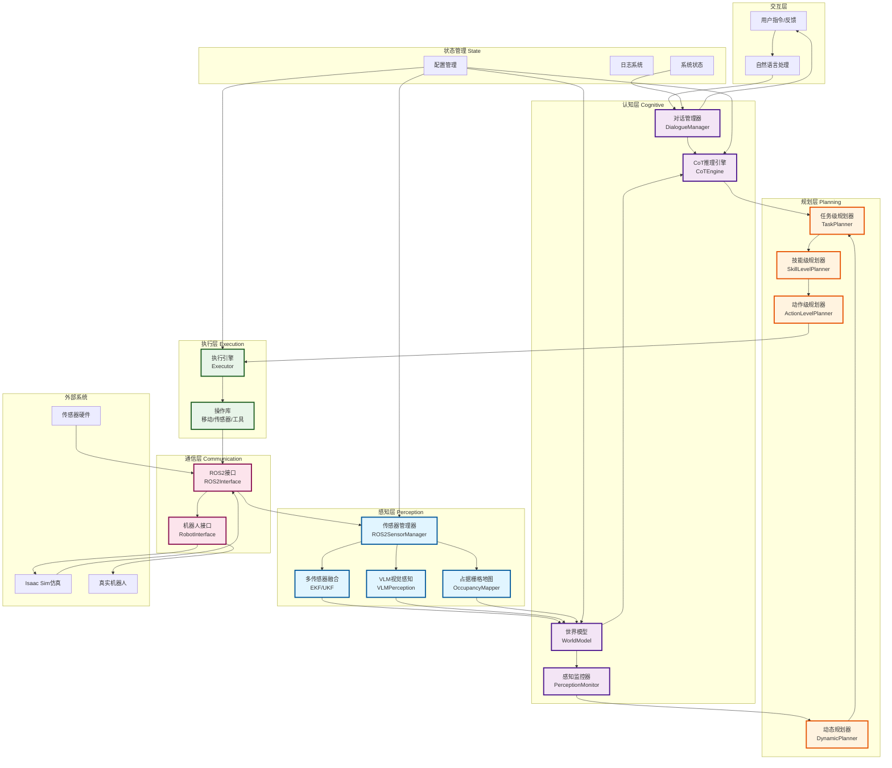
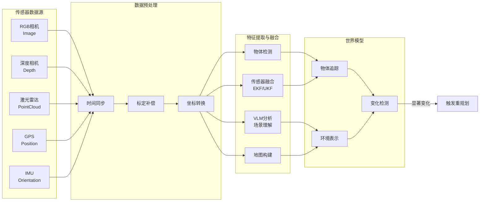
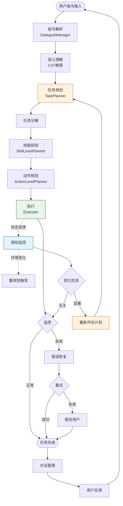
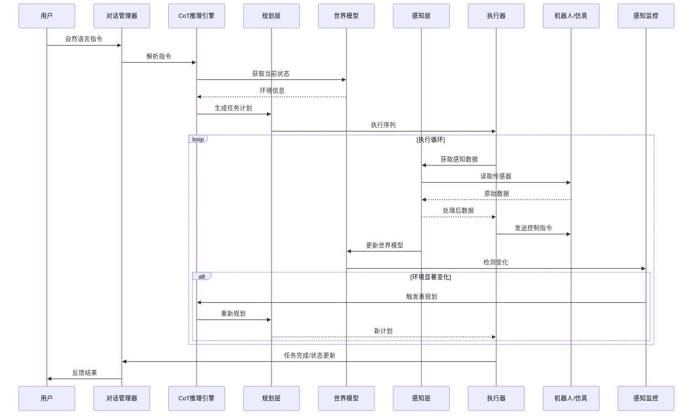
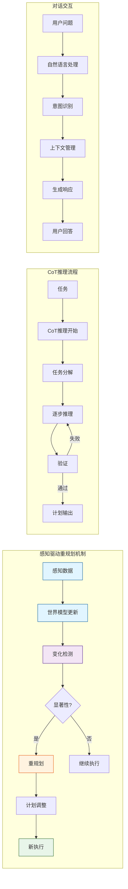
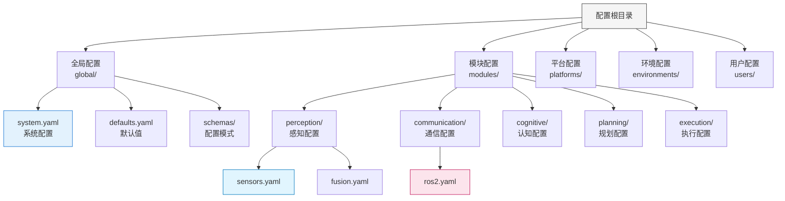
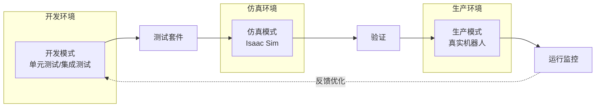

# Brain项目架构与数据流向

## 项目概述

Brain是一个**感知驱动的智能无人系统**，以World Model为核心，融合多传感器数据，实现环境感知、智能决策和自主控制。

---

## 1. 系统整体架构



---

## 2. 数据流向图

### 2.1 感知数据流



### 2.2 决策与控制数据流



### 2.3 端到端数据流



---

## 3. 核心模块交互图



---

## 4. 分层架构详解

### 4.1 感知层 (Perception Layer)

**位置**: `/brain/perception/`

| 模块 | 功能 | 输入 | 输出 |
|------|------|------|------|
| ROS2SensorManager | 传感器数据采集与管理 | 传感器硬件 | 原始数据流 |
| VLMPerception | 视觉语言模型场景理解 | RGB图像 | 语义信息 |
| OccupancyMapper | 占据栅格地图构建 | 点云数据 | 2D/3D地图 |
| SensorFusion | 多传感器数据融合 | 异构传感器 | 融合状态估计 |

**关键技术**:
- EKF/UKF滤波算法
- 点云处理 (PCL)
- VLM集成 (Ollama)
- 坐标系转换 (TF)

### 4.2 认知层 (Cognitive Layer)

**位置**: `/brain/cognitive/`

| 模块 | 功能 | 输入 | 输出 |
|------|------|------|------|
| WorldModel | 环境表示与状态维护 | 感知数据 | 世界状态 |
| CoTEngine | 链式思维推理 | 任务/上下文 | 推理结果 |
| DialogueManager | 对话交互管理 | 用户输入 | 响应输出 |
| PerceptionMonitor | 感知变化监控 | 感知流 | 重规划信号 |

**关键技术**:
- Chain-of-Thought推理
- 物体追踪与状态估计
- 变化检测算法
- 对话状态管理

### 4.3 规划层 (Planning Layer)

**位置**: `/brain/planning/`

| 规划器 | 粒度 | 功能 |
|--------|------|------|
| TaskPlanner | 任务级 | 高层任务分解与策略 |
| SkillLevelPlanner | 技能级 | 可重用技能组合 |
| ActionLevelPlanner | 动作级 | 具体动作序列生成 |
| DynamicPlanner | 动态 | 实时调整与重规划 |

**规划流程**:
```
任务 → 技能序列 → 动作序列 → 原子操作
  ↓        ↓          ↓         ↓
战略    战术      操作      执行
```

### 4.4 执行层 (Execution Layer)

**位置**: `/brain/execution/`

| 组件 | 功能 |
|------|------|
| Executor | 执行引擎,管理操作队列 |
| 移动操作 | 起飞、降落、导航 |
| 传感器操作 | 数据采集控制 |
| 工具操作 | 机械臂、抓取等 |

**执行特性**:
- 异步执行
- 状态监控
- 超时处理
- 错误恢复

### 4.5 通信层 (Communication Layer)

**位置**: `/brain/communication/`

| 接口 | 功能 |
|------|------|
| ROS2Interface | ROS2话题/服务/动作 |
| RobotInterface | 机器人控制抽象 |
| 紧急停止 | 安全机制 |

**支持的通信模式**:
- 发布/订阅 (Topic)
- 请求/响应 (Service)
- 目标/反馈 (Action)
- QoS配置

---

## 5. 配置系统架构



---

## 6. 部署模式



---

## 7. 技术栈

| 类别 | 技术 |
|------|------|
| **编程语言** | Python 3.8+ |
| **机器人框架** | ROS2 Humble |
| **AI/ML** | Ollama (VLM), OpenAI LLM |
| **数据处理** | NumPy, OpenCV, PCL |
| **异步处理** | asyncio |
| **日志系统** | Loguru |
| **仿真** | Isaac Sim |
| **配置管理** | YAML, Pydantic |

---

## 8. 关键设计模式

1. **分层架构**: 感知→认知→规划→执行
2. **世界模型**: 中央状态管理
3. **感知驱动**: 环境变化触发重规划
4. **CoT推理**: 可追溯的决策过程
5. **对话式交互**: 自然语言接口
6. **模块化配置**: 灵活的多层级配置系统

---

## 9. 数据流关键路径

### 正常执行路径
```
指令 → CoT推理 → 任务规划 → 技能规划 → 动作规划 → 执行 → 反馈
```

### 感知驱动重规划路径
```
感知数据 → 世界模型 → 变化检测 → 显著性评估 → 重规划 → 新计划 → 执行
```

### 错误恢复路径
```
执行异常 → 错误检测 → 恢复策略 → 重试/回退 → 报告用户
```

---

## 10. 扩展性设计

- **传感器扩展**: 插件式传感器管理器
- **规划器扩展**: 可替换的规划算法
- **执行器扩展**: 可扩展的操作库
- **通信扩展**: 支持多种机器人接口
- **AI模型扩展**: 可切换的VLM/LLM后端

---

*文档版本: 1.0*
*生成日期: 2026-01-06*
*项目: Brain - 感知驱动的智能无人系统*
