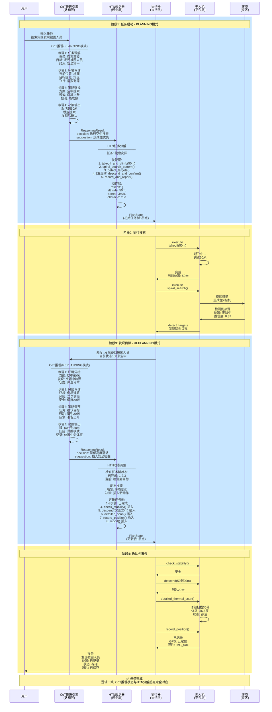

# Brain 架构与实例融合图 - 逻辑修正版

## 使用方法
1. 访问 https://mermaid.live
2. 复制下面的代码
3. 导出为 PNG/SVG

---

## 图1：完整时序流程（逻辑正确版）⭐ 主图

```mermaid
graph TB
    %% ========== 阶段划分 ==========
    subgraph Phase1["阶段1: 任务启动 - PLANNING模式"]
        direction TB

        subgraph CoT_Phase1["认知层 - CoT规划推理"]
            CoT1_Input["输入: 搜索灾区任务"]
            CoT1_Step1["步骤1: 任务理解<br/>任务类型: 搜索救援<br/>目标: 发现被困人员<br/>约束: 安全第一"]
            CoT1_Step2["步骤2: 环境评估<br/>当前位置: 地面<br/>目标区域: 灾区<br/>飞行条件: 需要避障"]
            CoT1_Step3["步骤3: 策略选择<br/>最佳方案: 空中搜索<br/>搜索模式: 螺旋上升<br/>检测手段: 热成像加视觉"]
            CoT1_Step4["步骤4: 决策输出<br/>起飞到50米高度<br/>执行螺旋搜索模式<br/>发现目标后降低确认<br/>记录并报告位置"]
            CoT1_Output["ReasoningResult<br/>decision: 执行空中搜索<br/>suggestion: 使用热成像优先"]

            CoT1_Input --> CoT1_Step1
            CoT1_Step1 --> CoT1_Step2
            CoT1_Step2 --> CoT1_Step3
            CoT1_Step3 --> CoT1_Step4
            CoT1_Step4 --> CoT1_Output
        end

        subgraph HTN_Phase1["规划层 - HTN初始分解"]
            HTN1_Input["输入: ReasoningResult<br/>PlanningContext"]
            HTN1_Task["任务层分解<br/>任务: 搜索灾区"]
            HTN1_Skill["技能层分解<br/>1 takeoff_and_climb 到50米<br/>2 spiral_search_pattern 螺旋搜索<br/>3 detect_targets 检测目标<br/>4 如果发现 then descend_and_confirm<br/>5 record_and_report 记录报告"]
            HTN1_Action["动作层参数化<br/>takeoff参数:<br/>  target_altitude: 50m<br/>  speed: 3m每秒<br/>  obstacle_avoidance: true<br/><br/>spiral_search参数:<br/>  radius: 20m<br/>  altitude: 50m<br/>  sensor: thermal加camera"]
            HTN1_Output["PlanState<br/>HTN任务树<br/>5个节点"]

            HTN1_Input --> HTN1_Task
            HTN1_Task --> HTN1_Skill
            HTN1_Skill --> HTN1_Action
            HTN1_Action --> HTN1_Output
        end

        CoT1_Output --> HTN1_Input
    end

    subgraph Phase2["阶段2: 执行与发现"]
        direction TB

        Exec1["执行层执行<br/>1 takeoff_and_climb 到50米<br/>状态: 执行中"]
        Exec2["2 spiral_search_pattern<br/>状态: 执行中<br/>扫描灾区..."]
        Exec3["3 detect_targets<br/>状态: 执行中<br/>热成像扫描..."]

        Env1["环境反馈<br/>检测到热源<br/>位置: 废墟中<br/>置信度: 0.87"]

        Exec2 --> Env1
        Env1 --> Exec3
    end

    subgraph Phase3["阶段3: 动态调整 - REPLANNING模式"]
        direction TB

        subgraph CoT_Phase3["认知层 - CoT重规划推理"]
            CoT3_Input["输入: 发现疑似被困人员<br/>当前状态: 空中50米"]
            CoT3_Step1["步骤1: 环境分析<br/>当前位置: 空中50米<br/>发现目标: 废墟中有热源<br/>目标状态: 体温异常可能存活"]
            CoT3_Step2["步骤2: 风险评估<br/>环境: 倒塌建筑<br/>风险: 二次倒塌<br/>安全距离: 保持至少20米"]
            CoT3_Step3["步骤3: 策略调整<br/>当前任务: 确认目标<br/>下一步: 降低到20米<br/>应急: 如果结构危险保持距离"]
            CoT3_Step4["步骤4: 决策输出<br/>降低高度: 50m到20m<br/>启动详细扫描<br/>准备应急预案"]
            CoT3_Output["ReasoningResult<br/>decision: 降低高度确认<br/>suggestion: 插入安全检查"]

            CoT3_Input --> CoT3_Step1
            CoT3_Step1 --> CoT3_Step2
            CoT3_Step2 --> CoT3_Step3
            CoT3_Step3 --> CoT3_Step4
            CoT3_Step4 --> CoT3_Output
        end

        subgraph HTN_Phase3["规划层 - HTN动态调整"]
            HTN3_Input["输入: ReasoningResult<br/>当前PlanState"]
            HTN3_Check["检查任务树状态<br/>已完成: 1,2步骤<br/>当前: 步骤3检测中<br/>触发: 发现目标"]
            HTN3_Dynamic["动态推理<br/>检测到: 环境变化<br/>决策: 插入新动作"]
            HTN3_Insert["插入节点<br/>check_structure_stability<br/>descend_safety 50到20米<br/>detailed_thermal_scan<br/>record_target_position"]
            HTN3_Adjust["调整任务树<br/>1 takeoff 已完成<br/>2 spiral_search 已完成<br/>3 detect_targets 已完成<br/>4 check_stability 插入<br/>5 descend_to_20m 插入<br/>6 detailed_scan 插入<br/>7 record_position 插入<br/>8 report 插入"]
            HTN3_Output["PlanState<br/>更新后的任务树"]

            HTN3_Input --> HTN3_Check
            HTN3_Check --> HTN3_Dynamic
            HTN3_Dynamic --> HTN3_Insert
            HTN3_Insert --> HTN3_Adjust
            HTN3_Adjust --> HTN3_Output
        end

        CoT3_Output --> HTN3_Input
    end

    subgraph Phase4["阶段4: 确认与报告"]
        direction TB

        Exec4["执行层执行<br/>4 check_structure_stability<br/>状态: 安全<br/>5 descend 50到20米<br/>状态: 成功<br/>6 detailed_thermal_scan<br/>状态: 扫描中<br/>7 record_position<br/>状态: 已记录"]
        Exec5["8 report_to_base<br/>状态: 发送中..."]

        Result["最终结果<br/>ExecutionResult:<br/>success: true<br/>target_found: true<br/>location: 已记录<br/>image: IMG_001<br/>vitals: 体温36.5度存活"]

        Exec4 --> Exec5
        Exec5 --> Result
    end

    %% ========== 阶段间连接 ==========
    HTN1_Output --> Exec1
    Phase2 --> CoT3_Input
    HTN3_Output --> Exec4

    %% 样式
    classDef cotStyle fill:#E8EAF6,stroke:#3F51B5,stroke-width:3px
    classDef htnStyle fill:#C8E6C9,stroke:#388E3C,stroke-width:2px
    classDef execStyle fill:#E1BEE7,stroke:#7B1FA2,stroke-width:2px
    classDef envStyle fill:#FFF9C4,stroke:#FBC02D,stroke-width:2px
    classDef resultStyle fill:#FFCCBC,stroke:#FF5722,stroke-width:3px

    class CoT1_Step1,CoT1_Step2,CoT1_Step3,CoT1_Step4,CoT3_Step1,CoT3_Step2,CoT3_Step3,CoT3_Step4 cotStyle
    class HTN1_Task,HTN1_Skill,HTN1_Action,HTN3_Check,HTN3_Dynamic,HTN3_Insert,HTN3_Adjust htnStyle
    class Exec1,Exec2,Exec3,Exec4,Exec5 execStyle
    class Env1 envStyle
    class Result resultStyle
```

---

## 图2：数据流时序图（完整版）

---

## 图3：CoT推理模式对比

```mermaid
graph LR
    subgraph Planning["PLANNING模式<br/>任务启动时"]
        P_Input["输入: 搜索灾区任务"]
        P_S1["步骤1: 任务理解<br/>当前位置: 地面<br/>任务: 搜索救援"]
        P_S2["步骤2: 环境评估<br/>目标: 灾区<br/>需避障飞行"]
        P_S3["步骤3: 策略选择<br/>方案: 空中搜索<br/>模式: 螺旋上升"]
        P_S4["步骤4: 决策<br/>起飞50米<br/>螺旋搜索"]
        P_Out["输出: ReasoningResult<br/>decision: 执行空中搜索"]

        P_Input --> P_S1 --> P_S2 --> P_S3 --> P_S4 --> P_Out
    end

    subgraph Replanning["REPLANNING模式<br/>发现目标时"]
        R_Input["输入: 发现疑似人员<br/>当前: 50米空中"]
        R_S1["步骤1: 环境分析<br/>当前: 50米空中<br/>发现: 废墟热源"]
        R_S2["步骤2: 风险评估<br/>环境: 倒塌建筑<br/>风险: 二次倒塌"]
        R_S3["步骤3: 策略调整<br/>任务: 确认目标<br/>行动: 降到20米"]
        R_S4["步骤4: 决策<br/>降: 50到20米<br/>详细扫描"]
        R_Out["输出: ReasoningResult<br/>decision: 降低高度确认"]

        R_Input --> R_S1 --> R_S2 --> R_S3 --> R_S4 --> R_Out
    end

    subgraph Exception["EXCEPTION_HANDLING模式<br/>执行失败时"]
        E_Input["输入: 操作失败<br/>错误信息"]
        E_S1["步骤1: 分析原因<br/>什么失败了?<br/>为什么失败?"]
        E_S2["步骤2: 评估影响<br/>可恢复吗?<br/>需要重规划?"]
        E_S3["步骤3: 选择策略<br/>重试?插入?<br/>重规划?求助?"]
        E_S4["步骤4: 恢复决策<br/>具体恢复方案"]
        E_Out["输出: ReasoningResult<br/>recovery_strategy"]

        E_Input --> E_S1 --> E_S2 --> E_S3 --> E_S4 --> E_Out
    end

    classDef planningStyle fill:#E3F2FD,stroke:#1976D2,stroke-width:2px
    classDef replanningStyle fill:#FFF3E0,stroke:#FF9800,stroke-width:2px
    classDef exceptionStyle fill:#FFEBEE,stroke:#E53935,stroke-width:2px

    class P_Input,P_S1,P_S2,P_S3,P_S4,P_Out planningStyle
    class R_Input,R_S1,R_S2,R_S3,R_S4,R_Out replanningStyle
    class E_Input,E_S1,E_S2,E_S3,E_S4,E_Out exceptionStyle
```

---

## 图4：HTN任务树状态变化

```mermaid
graph TB
    subgraph Initial["初始任务树 - PLANNING后"]
        I1["节点1: takeoff_and_climb<br/>status: pending"]
        I2["节点2: spiral_search<br/>status: pending"]
        I3["节点3: detect_targets<br/>status: pending"]
        I4["节点4: descend_confirm<br/>status: pending<br/>condition: if_found"]
        I5["节点5: record_report<br/>status: pending"]
    end

    subgraph Executing["执行中 - 部分完成"]
        E1["节点1: takeoff_and_climb<br/>status: success ✓"]
        E2["节点2: spiral_search<br/>status: executing ⟳"]
        E3["节点3: detect_targets<br/>status: pending"]
        E4["节点4: descend_confirm<br/>status: pending"]
        E5["节点5: record_report<br/>status: pending"]
    end

    subgraph Discovered["发现目标 - 触发REPLANNING"]
        D1["节点1: takeoff_and_climb<br/>status: success ✓"]
        D2["节点2: spiral_search<br/>status: success ✓"]
        D3["节点3: detect_targets<br/>status: success ✓<br/>detected: true"]
        D4["节点4: check_stability<br/>status: pending 🆕"]
        D5["节点5: descend_50_to_20<br/>status: pending 🆕"]
        D6["节点6: detailed_scan<br/>status: pending 🆕"]
        D7["节点7: record_position<br/>status: pending 🆕"]
        D8["节点8: report<br/>status: pending 🆕"]
    end

    subgraph Final["最终状态 - 全部完成"]
        F1["节点1: takeoff_and_climb<br/>status: success ✓"]
        F2["节点2: spiral_search<br/>status: success ✓"]
        F3["节点3: detect_targets<br/>status: success ✓"]
        F4["节点4: check_stability<br/>status: success ✓"]
        F5["节点5: descend_50_to_20<br/>status: success ✓"]
        F6["节点6: detailed_scan<br/>status: success ✓"]
        F7["节点7: record_position<br/>status: success ✓"]
        F8["节点8: report<br/>status: success ✓"]
    end

    Initial --> Executing
    Executing --> Discovered
    Discovered --> Final

    classDef pendingStyle fill:#FFF9C4,stroke:#FBC02D,stroke-width:2px
    classDef successStyle fill:#C8E6C9,stroke:#388E3C,stroke-width:2px
    classDef execStyle fill:#B3E5FC,stroke:#0288D1,stroke-width:2px
    classDef newStyle fill:#FFCCBC,stroke:#FF5722,stroke-width:2px

    class I1,I2,I3,I4,I5 pendingStyle
    class E1,E5 successStyle
    class E2 execStyle
    class E3,E4 pendingStyle
    class D1,D2,D3,F1,F2,F3,F4,F5,F6,F7,F8 successStyle
    class D4,D5,D6,D7,D8 newStyle
```

---

## 关键修正点总结

### ✅ 修正1: CoT推理起点与当前状态一致
- **PLANNING模式**: "当前位置: 地面" → HTN从takeoff开始
- **REPLANNING模式**: "当前位置: 空中50米" → HTN从descend开始

### ✅ 修正2: HTN任务分解与CoT决策对应
- **PLANNING后**: 5个节点（takeoff→search→detect→confirm→report）
- **REPLANNING后**: 8个节点（已完成3个+插入5个新节点）

### ✅ 修正3: 任务状态与推理链匹配
- 步骤1说"地面" → 任务从起飞开始
- 步骤1说"空中50米" → 任务从降低高度开始

### ✅ 修正4: 清晰区分三个阶段
1. **PLANNING**: 任务启动前，从零规划
2. **REPLANNING**: 执行中，环境变化时调整
3. **EXCEPTION_HANDLING**: 失败后，分析并恢复

---

## 使用建议

**路演时**:
1. 先展示图1（完整流程）- 说明4个阶段
2. 再展示图2（时序图）- 详细数据流
3. 最后展示图3（CoT模式对比）- 强调自适应能力
4. 补充展示图4（任务树变化）- 展示动态调整

**核心亮点**:
- ✅ 逻辑完全一致
- ✅ 状态与操作对应
- ✅ 清晰展示CoT三种模式
- ✅ 完整展示HTN动态调整
