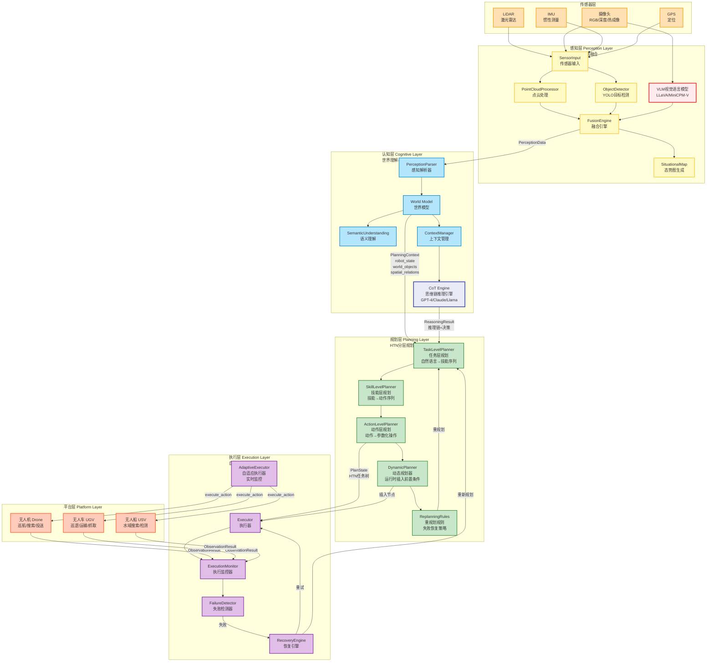
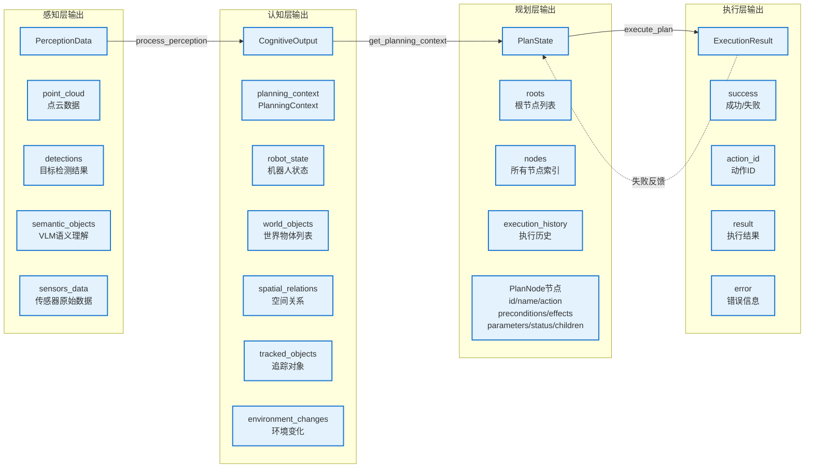
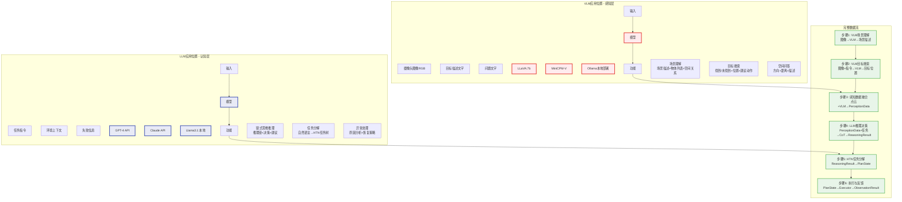
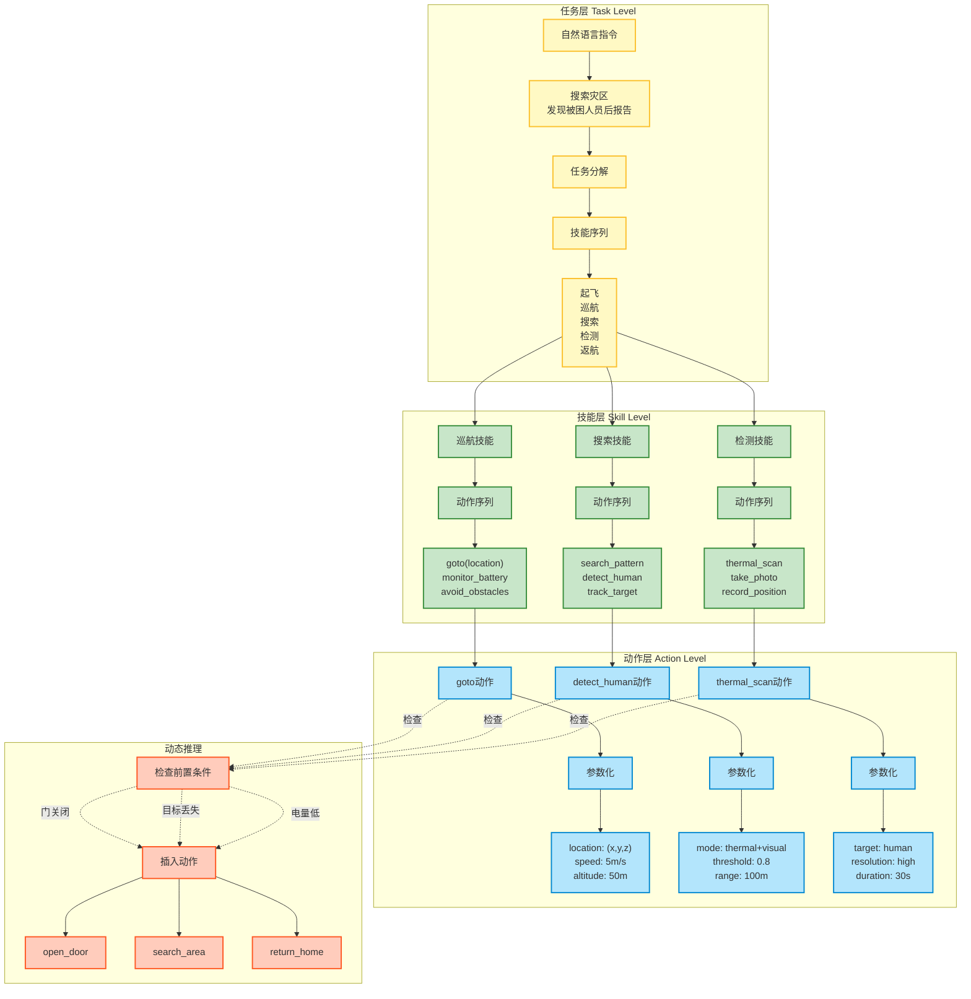
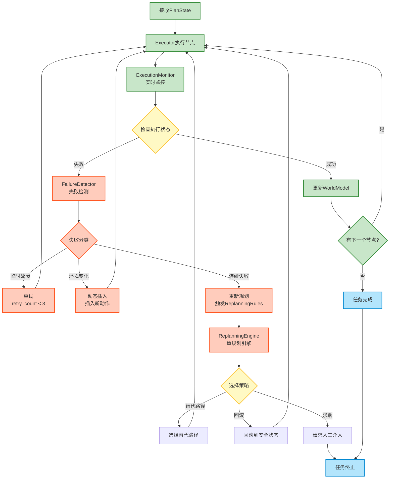
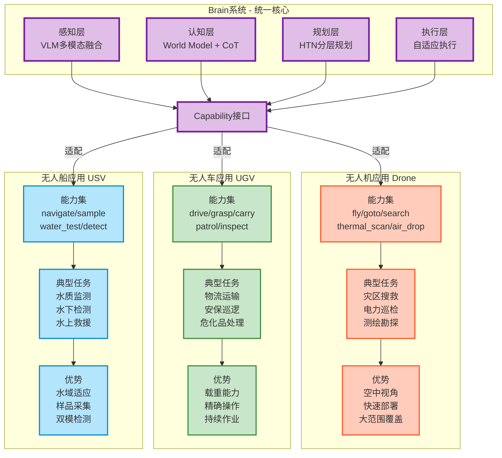

# Brain 项目完整架构图 - Mermaid代码

## 使用方法
1. 访问 https://mermaid.live
2. 将下面的代码复制到编辑器
3. 导出为 PNG/SVG 格式

---

## 图1：完整系统架构图（主图）



---

## 图2：数据流详解图



---

## 图3：大模型应用位置图



---

## 图4：HTN分层规划详解



---

## 图5：自适应执行流程



---

## 图6：三平台统一架构对比



---

## 快速使用指南

### 方案1：在线预览（推荐）
1. 打开 https://mermaid.live
2. 复制上面任意图的代码（从```mermaid到```）
3. 粘贴到左侧编辑器
4. 右侧实时预览
5. 点击"Download PNG/SVG"下载

### 方案2：在Markdown中使用
如果你使用Typora、VS Code等支持Mermaid的编辑器：
- 直接复制代码块到Markdown文件
- 编辑器会自动渲染成图

### 方案3：生成到PPT
1. 在Mermaid Live生成图片
2. 下载为PNG/SVG
3. 插入到你的PPT中

---

## 建议

**用于路演PPT**：
- 使用图1（完整系统架构图）作为主图
- 配合图3（大模型应用位置）展示AI能力

**用于技术文档**：
- 图2（数据流详解）+ 图4（HTN分层规划）
- 图5（自适应执行流程）

**用于应用场景展示**：
- 图6（三平台统一架构对比）

需要我调整任何图的样式或内容吗？
