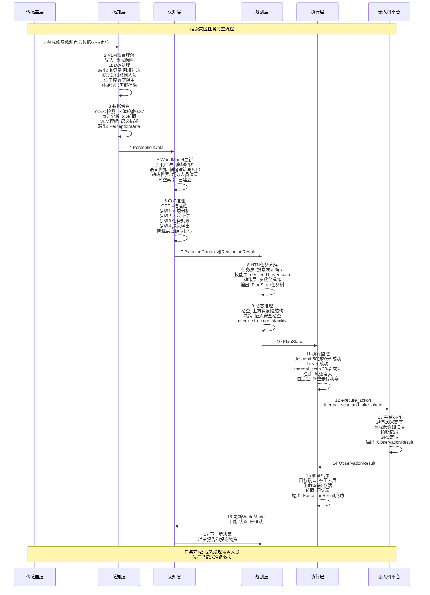
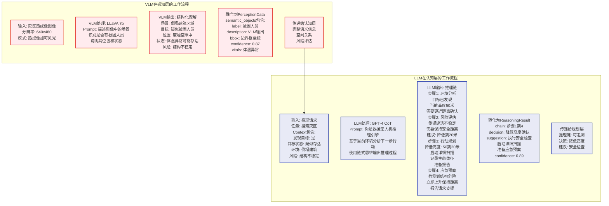

# Brain 架构与实例融合图 - Mermaid代码（修正版）

## 使用方法
1. 访问 https://mermaid.live
2. 复制下面的代码
3. 导出为 PNG/SVG

---

## 图1：架构+实例完整融合图（主图）

```mermaid
graph TB
    %% ========== 传感器层 ==========
    subgraph Sensors["传感器层"]
        direction LR
        LIDAR["LiDAR激光雷达<br/>生成点云地图"]
        CAM["摄像头<br/>RGB和热成像<br/>捕获灾区图像"]
        IMU["IMU惯性测量<br/>姿态和速度"]
        GPS["GPS定位<br/>确定位置"]
    end

    %% ========== 感知层 ==========
    subgraph Perception["感知层 - 多模态数据融合与VLM"]
        direction TB

        subgraph PercArch["架构模块"]
            P1["SensorInput<br/>传感器输入"]
            P2["PointCloudProcessor<br/>点云处理"]
            P3["ObjectDetector<br/>YOLO检测"]
            P4["VLM视觉语言模型<br/>LLaVA"]
            P5["FusionEngine<br/>融合引擎"]
        end

        subgraph PercExample["实例 - 搜索灾区"]
            PE1["接收LiDAR点云<br/>接收热成像图像<br/>接收GPS定位"]
            PE2["提取地面平面<br/>识别障碍物<br/>构建三维地图"]
            PE3["YOLO检测可疑区域<br/>发现人体轮廓<br/>置信度 0.87"]
            PE4["VLM场景理解<br/>输入: 热成像图<br/>输出: 检测到倒塌建筑区域<br/>发现疑似被困人员<br/>位于废墟空隙中<br/>体温异常可能存活"]
            PE5["融合结果 PerceptionData<br/>point_cloud: XYZ点云<br/>detections: 人体置信度0.87<br/>semantic_objects: VLM描述<br/>location: 位置已记录<br/>timestamp: 时间戳"]
        end

        P1 --> PE1
        P2 --> PE2
        P3 --> PE3
        P4 --> PE4
        P5 --> PE5
    end

    %% ========== 认知层 ==========
    subgraph Cognitive["认知层 - WorldModel与CoT推理"]
        direction TB

        subgraph CogArch["架构模块"]
            C1["PerceptionParser<br/>感知解析器"]
            C2["World Model<br/>世界模型"]
            C3["SemanticUnderstanding<br/>语义理解"]
            C4["CoT Engine<br/>思维链推理<br/>GPT-4"]
        end

        subgraph CogExample["实例 - 分析灾区环境"]
            CE1["解析PerceptionData<br/>提取结构化信息"]
            CE2["WorldModel更新<br/>几何世界: 废墟区域障碍物<br/>语义世界: 倒塌建筑高风险<br/>动态世界: 疑似人员位置<br/>时空索引: 毫秒级查询"]
            CE3["语义标注<br/>关系抽取: 人员在建筑废墟中"]
            CE4["CoT推理链<br/>步骤1 环境分析<br/>当前位置: 空中50米<br/>发现目标: 废墟中有疑似被困人员<br/>目标状态: 体温异常可能存活<br/>步骤2 风险评估<br/>环境: 倒塌建筑结构不稳定<br/>风险: 二次倒塌可能性<br/>决策: 保持安全距离低空悬停<br/>步骤3 任务规划<br/>当前任务: 搜索并发现被困人员<br/>下一步: 降低高度确认目标<br/>应急准备: 准备投送救援物资<br/>步骤4 决策输出<br/>目标已发现<br/>建议降低到20米高度<br/>启动热成像详细扫描<br/>准备报告位置"]
        end

        C1 --> CE1
        C2 --> CE2
        C3 --> CE3
        C4 --> CE4
    end

    %% ========== 规划层 ==========
    subgraph Planning["规划层 - HTN分层规划与动态推理"]
        direction TB

        subgraph PlanArch["架构模块"]
            PL1["TaskLevelPlanner<br/>任务层"]
            PL2["SkillLevelPlanner<br/>技能层"]
            PL3["ActionLevelPlanner<br/>动作层"]
            PL4["DynamicPlanner<br/>动态规划"]
        end

        subgraph PlanExample["实例 - 任务分解"]
            PLE1["任务层分解<br/>输入: 搜索灾区发现被困人员后报告<br/>分解为技能序列:<br/>1 起飞到巡航高度<br/>2 执行搜索模式<br/>3 检测到人员<br/>4 降低高度确认<br/>5 记录位置和状态<br/>6 返回报告"]
            PLE2["技能层分解<br/>技能: 降低高度确认<br/>动作序列:<br/>1 descend 高度50到20米<br/>2 hover 悬停<br/>3 thermal_scan 热成像扫描<br/>4 take_photo 拍照记录<br/>5 record_position 记录坐标<br/>6 detect_vitals 检测生命体征"]
            PLE3["动作层参数化<br/>动作: thermal_scan<br/>参数: mode detailed<br/>resolution high<br/>duration 30秒<br/>target_area 已定位<br/>thermal_threshold 34度<br/>动作: record_position<br/>参数: location 已定位<br/>accuracy high<br/>timestamp 已记录<br/>photo_id IMG_001<br/>vitals 体温36.5度状态存活"]
            PLE4["动态推理<br/>检测: 环境变化<br/>发现: 目标上方有危险结构<br/>决策: 插入安全检查动作<br/>插入动作: check_structure_stability<br/>如果不稳定则保持距离<br/>如果稳定则继续接近<br/>结果: 安全检查通过继续执行"]
        end

        PL1 --> PLE1
        PL2 --> PLE2
        PL3 --> PLE3
        PL4 --> PLE4
    end

    %% ========== 执行层 ==========
    subgraph Execution["执行层 - 自适应执行与失败恢复"]
        direction TB

        subgraph ExecArch["架构模块"]
            E1["Executor<br/>执行器"]
            E2["AdaptiveExecutor<br/>自适应执行"]
            E3["ExecutionMonitor<br/>监控器"]
            E4["FailureDetector<br/>失败检测"]
        end

        subgraph ExecExample["实例 - 执行与监控"]
            EE1["执行动作序列<br/>1 descend 50到20米 成功<br/>2 hover 成功<br/>3 thermal_scan 30秒 成功<br/>4 take_photo 成功<br/>5 record_position 成功<br/>6 detect_vitals 成功"]
            EE2["实时自适应<br/>监控: 执行thermal_scan时<br/>检测: 风速突然增大到8米每秒<br/>反应: 自动调整悬停功率<br/>结果: 保持稳定扫描继续"]
            EE3["执行监控<br/>状态跟踪:<br/>动作: thermal_scan<br/>进度: 25到30秒<br/>结果: 发现热源<br/>置信度: 0.92<br/>生命体征: 存在<br/>验证: 目标确认为被困人员<br/>状态: 存活体温36.5度"]
            EE4["失败检测<br/>动作: take_photo<br/>状态: 成功<br/>错误: 无<br/>最终结果: ExecutionResult<br/>success: true<br/>action_id: search_and_report<br/>target_found: true<br/>location: 已记录<br/>photo: IMG_001.jpg<br/>vitals: 体温36.5度存活<br/>error: null"]
        end

        E1 --> EE1
        E2 --> EE2
        E3 --> EE3
        E4 --> EE4
    end

    %% ========== 平台层 ==========
    subgraph Platforms["平台层 - 实际执行设备"]
        Drone["无人机 Drone<br/>飞行: 悬停在20米高度<br/>热成像: 完成详细扫描<br/>拍照: 记录被困人员位置<br/>定位: GPS坐标已记录<br/>通信: 实时传输数据<br/>ObservationResult:<br/>target_detected: true<br/>location: 已记录<br/>image: IMG_001.jpg<br/>thermal: 检测到热源"]
    end

    %% ========== 数据流连接 ==========
    Sensors --> Perception
    Perception -->|PerceptionData| Cognitive
    Cognitive -->|PlanningContext| Planning
    Planning -->|PlanState| Execution
    Execution -->|execute_action| Platforms
    Platforms -->|ObservationResult| Execution

    %% 样式定义
    classDef sensorStyle fill:#FFE0B2,stroke:#FF9800,stroke-width:2px
    classDef perceptionStyle fill:#FFF9C4,stroke:#FBC02D,stroke-width:2px
    classDef cognitiveStyle fill:#B3E5FC,stroke:#0288D1,stroke-width:2px
    classDef planningStyle fill:#C8E6C9,stroke:#388E3C,stroke-width:2px
    classDef executionStyle fill:#E1BEE7,stroke:#7B1FA2,stroke-width:2px
    classDef platformStyle fill:#FFCCBC,stroke:#FF5722,stroke-width:2px
    classDef vlmStyle fill:#FFEBEE,stroke:#E53935,stroke-width:3px
    classDef llmStyle fill:#E8EAF6,stroke:#3F51B5,stroke-width:3px

    class LIDAR,CAM,IMU,GPS sensorStyle
    class P1,P2,P3,P4,P5,PE1,PE2,PE3,PE4,PE5 perceptionStyle
    class C1,C2,C3,C4,CE1,CE2,CE3,CE4 cognitiveStyle
    class PL1,PL2,PL3,PL4,PLE1,PLE2,PLE3,PLE4 planningStyle
    class E1,E2,E3,E4,EE1,EE2,EE3,EE4 executionStyle
    class Drone platformStyle
    class P4,PE4 vlmStyle
    class C4,CE4 llmStyle
```

---

## 图2：数据流时序图

---

## 图3：VLM和LLM详细工作流程

---

## 主要修改点

1. **移除所有括号**：将 `(x,y,z)` 改为 `已记录` 或文字描述
2. **移除花括号**：将 `{key: value}` 改为多行文本
3. **移除特殊符号**：如 `→` 改为 `和` 或空格
4. **简化数据结构**：用文字描述代替复杂的嵌套结构
5. **统一分隔符**：使用 ` ` 和 `─` 而不是特殊字符

---

## 使用建议

现在代码应该可以在 https://mermaid.live 正常渲染了。

**推荐使用顺序**：
1. 先渲染图1（主图） - 最全面的架构与实例融合
2. 再渲染图2（时序图） - 清晰展示数据流动
3. 最后渲染图3（VLM/LLM） - 详细展示AI工作流程

如果还有问题，可以进一步简化文本内容。
