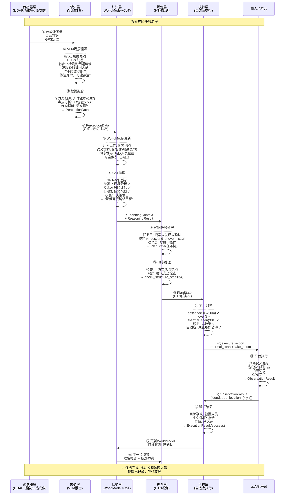
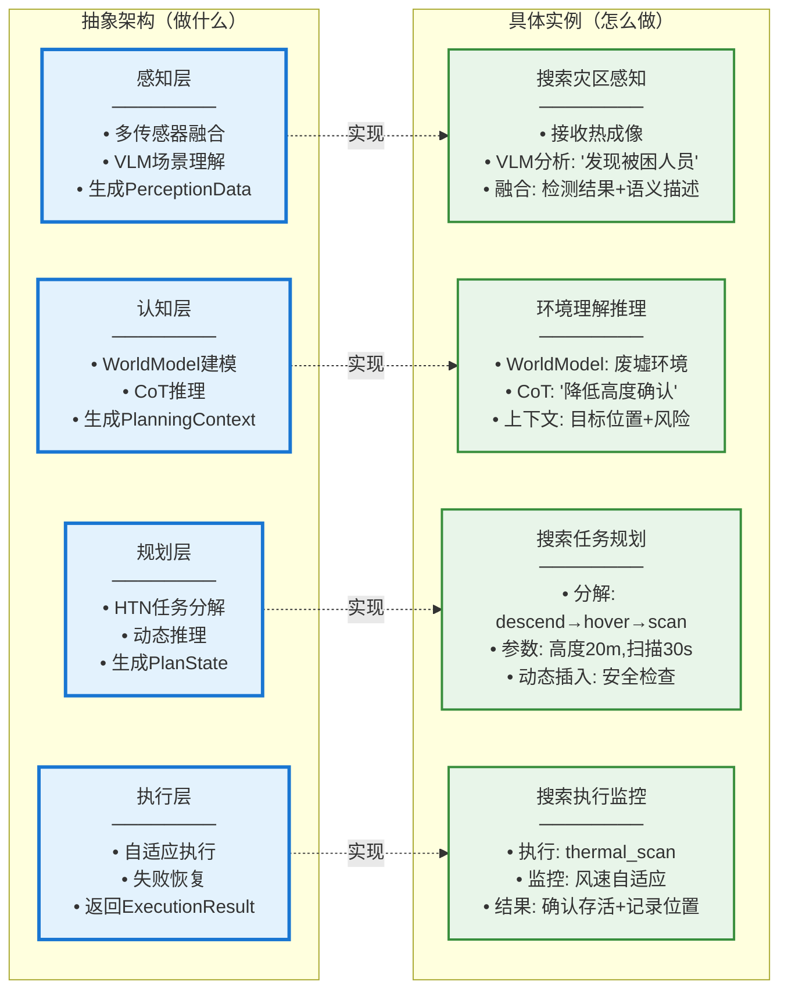

# Brain 架构与实例融合图 - Mermaid代码

## 使用方法
1. 访问 https://mermaid.live
2. 复制下面的代码
3. 导出为 PNG/SVG

---

## 主图：架构+实例完整融合图

```mermaid
graph TB
    %% ========== 传感器层 ==========
    subgraph Sensors["传感器层 Sensor Layer"]
        direction LR
        LIDAR[LiDAR<br/>激光雷达<br/>↓<br/>生成点云地图]
        CAM[摄像头<br/>RGB/热成像<br/>↓<br/>捕获灾区图像]
        IMU[IMU<br/>惯性测量<br/>↓<br/>姿态和速度]
        GPS[GPS<br/>定位<br/>↓<br/>确定无人机位置]
    end

    %% ========== 感知层 ==========
    subgraph Perception["感知层 Perception Layer<br/>多模态数据融合 + VLM视觉理解"]
        direction TB

        subgraph PercArch["【架构模块】"]
            P1[SensorInput<br/>传感器输入]
            P2[PointCloudProcessor<br/>点云处理]
            P3[ObjectDetector<br/>YOLO检测]
            P4[VLM视觉语言模型<br/>LLaVA]
            P5[FusionEngine<br/>融合引擎]
        end

        subgraph PercExample["【实例：搜索灾区】"]
            PE1["✓ 接收LiDAR点云<br/>✓ 接收热成像图像<br/>✓ 接收GPS定位"]
            PE2["✓ 提取地面平面<br/>✓ 识别障碍物<br/>✓ 构建三维地图"]
            PE3["✓ YOLO检测可疑区域<br/>✓ 发现人体轮廓<br/>✓ 置信度: 0.87"]
            PE4["⭐ VLM场景理解<br/>输入: 热成像图<br/>输出: '检测到倒塌建筑区域<br/>发现疑似被困人员<br/>位于废墟空隙中<br/>体温异常，可能存活'"]
            PE5["⭐ 融合结果: PerceptionData<br/>{<br/>  point_cloud: XYZ点云<br/>  detections: 人体(置信度0.87)<br/>  semantic_objects: VLM描述<br/>  location: (x,y,z)<br/>  timestamp: t1<br/>}"]
        end

        P1 --> PE1
        P2 --> PE2
        P3 --> PE3
        P4 --> PE4
        P5 --> PE5
    end

    %% ========== 认知层 ==========
    subgraph Cognitive["认知层 Cognitive Layer<br/>World Model + CoT推理引擎"]
        direction TB

        subgraph CogArch["【架构模块】"]
            C1[PerceptionParser<br/>感知解析器]
            C2[World Model<br/>世界模型]
            C3[SemanticUnderstanding<br/>语义理解]
            C4[CoT Engine<br/>思维链推理<br/>GPT-4]
        end

        subgraph CogExample["【实例：分析灾区环境】"]
            CE1["✓ 解析PerceptionData<br/>✓ 提取结构化信息"]
            CE2["⭐ WorldModel更新<br/>几何世界: 废墟区域、障碍物分布<br/>语义世界: 倒塌建筑(有人被困风险)<br/>动态世界: 疑似人员位置(x,y,z)<br/>时空索引: 毫秒级查询"]
            CE3["✓ 语义标注<br/>✓ 关系抽取: '人员在建筑废墟中'"]
            CE4["⭐ CoT推理链<br/>───────────────<br/>步骤1: 环境分析<br/>  当前位置: 空中50米<br/>  发现目标: 废墟中有疑似被困人员<br/>  目标状态: 体温异常，可能存活<br/><br/>步骤2: 风险评估<br/>  环境: 倒塌建筑，结构不稳定<br/>  风险: 二次倒塌可能性<br/>  决策: 保持安全距离，低空悬停<br/><br/>步骤3: 任务规划<br/>  当前任务: 搜索并发现被困人员<br/>  下一步: 降低高度确认目标<br/>  应急准备: 准备投送救援物资<br/><br/>步骤4: 决策输出<br/>  ✓ 目标已发现<br/>  ✓ 建议降低到20米高度<br/>  ✓ 启动热成像详细扫描<br/>  ✓ 准备报告位置"]
        end

        C1 --> CE1
        C2 --> CE2
        C3 --> CE3
        C4 --> CE4
    end

    %% ========== 规划层 ==========
    subgraph Planning["规划层 Planning Layer<br/>HTN分层规划 + 动态推理"]
        direction TB

        subgraph PlanArch["【架构模块】"]
            PL1[TaskLevelPlanner<br/>任务层]
            PL2[SkillLevelPlanner<br/>技能层]
            PL3[ActionLevelPlanner<br/>动作层]
            PL4[DynamicPlanner<br/>动态规划]
        end

        subgraph PlanExample["【实例：任务分解】"]
            PLE1["⭐ 任务层分解<br/>───────────────<br/>输入: '搜索灾区，发现被困人员后报告'<br/><br/>分解为技能序列:<br/>1. 起飞到巡航高度<br/>2. 执行搜索模式<br/>3. 检测到人员<br/>4. 降低高度确认<br/>5. 记录位置和状态<br/>6. 返回报告"]
            PLE2["⭐ 技能层分解<br/>───────────────<br/>技能: '降低高度确认'<br/>→ 动作序列:<br/>  1. descend(高度: 50m→20m)<br/>  2. hover(悬停)<br/>  3. thermal_scan(热成像扫描)<br/>  4. take_photo(拍照记录)<br/>  5. record_position(记录坐标)<br/>  6. detect_vitals(检测生命体征)"]
            PLE3["⭐ 动作层参数化<br/>───────────────<br/>动作: thermal_scan<br/>参数: {<br/>  mode: 'detailed',<br/>  resolution: 'high',<br/>  duration: 30s,<br/>  target_area: (x±10, y±10, z±5),<br/>  thermal_threshold: 34°C<br/>}<br/><br/>动作: record_position<br/>参数: {<br/>  location: (x, y, z),<br/>  accuracy: 'high',<br/>  timestamp: t2,<br/>  photo_id: IMG_001,<br/>  vitals: {temp: 36.5°C, status: alive}<br/>}"]
            PLE4["⭐ 动态推理<br/>───────────────<br/>检测: 环境变化<br/>→ 发现: 目标上方有危险结构<br/>→ 决策: 插入安全检查动作<br/><br/>插入动作:<br/>  check_structure_stability()<br/>  如果不稳定 → 保持距离<br/>  如果稳定 → 继续接近<br/><br/>结果: 安全检查通过，继续执行"]
        end

        PL1 --> PLE1
        PL2 --> PLE2
        PL3 --> PLE3
        PL4 --> PLE4
    end

    %% ========== 执行层 ==========
    subgraph Execution["执行层 Execution Layer<br/>自适应执行 + 失败恢复"]
        direction TB

        subgraph ExecArch["【架构模块】"]
            E1[Executor<br/>执行器]
            E2[AdaptiveExecutor<br/>自适应执行]
            E3[ExecutionMonitor<br/>监控器]
            E4[FailureDetector<br/>失败检测]
        end

        subgraph ExecExample["【实例：执行与监控】"]
            EE1["✓ 执行动作序列<br/>1. descend(50→20m) ✓<br/>2. hover() ✓<br/>3. thermal_scan(30s) ✓<br/>4. take_photo() ✓<br/>5. record_position() ✓<br/>6. detect_vitals() ✓"]
            EE2["⭐ 实时自适应<br/>───────────────<br/>监控: 执行thermal_scan时<br/>检测: 风速突然增大到8m/s<br/>反应: 自动调整悬停功率<br/>结果: 保持稳定，扫描继续"]
            EE3["⭐ 执行监控<br/>───────────────<br/>状态跟踪:<br/>✓ 动作: thermal_scan<br/>✓ 进度: 25/30秒<br/>✓ 结果: 发现热源<br/>✓ 置信度: 0.92<br/>✓ 生命体征: 存在<br/><br/>验证: 目标确认为被困人员<br/>状态: 存活，体温36.5°C"]
            EE4["✓ 失败检测<br/>───────────────<br/>动作: take_photo<br/>状态: 成功<br/>错误: 无<br/><br/>最终结果: ExecutionResult{<br/>  success: true,<br/>  action_id: 'search_and_report',<br/>  result: {<br/>    target_found: true,<br/>    location: (x, y, z),<br/>    photo: IMG_001.jpg,<br/>    vitals: {temp: 36.5, alive: true}<br/>  },<br/>  error: null<br/>}"]
        end

        E1 --> EE1
        E2 --> EE2
        E3 --> EE3
        E4 --> EE4
    end

    %% ========== 平台层 ==========
    subgraph Platforms["平台层 Platform Layer - 实际执行设备"]
        Drone["无人机 Drone<br/>飞行: 悬停在20米高度<br/>热成像: 完成详细扫描<br/>拍照: 记录被困人员位置<br/>定位: GPS坐标已记录<br/>通信: 实时传输数据<br/>──────────────<br/>ObservationResult:<br/>target_detected: true<br/>location: 已记录<br/>image: IMG_001.jpg<br/>thermal: 检测到热源"]
    end

    %% ========== 数据流连接 ==========
    Sensors --> Perception
    Perception -->|PerceptionData| Cognitive
    Cognitive -->|PlanningContext| Planning
    Planning -->|PlanState| Execution
    Execution -->|execute_action| Platforms
    Platforms -->|ObservationResult| Execution

    %% 样式定义
    classDef sensorStyle fill:#FFE0B2,stroke:#FF9800,stroke-width:2px
    classDef perceptionStyle fill:#FFF9C4,stroke:#FBC02D,stroke-width:2px
    classDef cognitiveStyle fill:#B3E5FC,stroke:#0288D1,stroke-width:2px
    classDef planningStyle fill:#C8E6C9,stroke:#388E3C,stroke-width:2px
    classDef executionStyle fill:#E1BEE7,stroke:#7B1FA2,stroke-width:2px
    classDef platformStyle fill:#FFCCBC,stroke:#FF5722,stroke-width:2px
    classDef exampleStyle fill:#E8F5E9,stroke:#4CAF50,stroke-width:2px,stroke-dasharray: 5 5
    classDef highlightStyle fill:#FFEBEE,stroke:#E53935,stroke-width:3px
    classDef vlmStyle fill:#FFEBEE,stroke:#E53935,stroke-width:3px
    classDef llmStyle fill:#E8EAF6,stroke:#3F51B5,stroke-width:3px

    class LIDAR,CAM,IMU,GPS sensorStyle
    class P1,P2,P3,P4,P5,PE1,PE2,PE3,PE4,PE5 perceptionStyle
    class C1,C2,C3,C4,CE1,CE2,CE3,CE4 cognitiveStyle
    class PL1,PL2,PL3,PL4,PLE1,PLE2,PLE3,PLE4 planningStyle
    class E1,E2,E3,E4,EE1,EE2,EE3,EE4 executionStyle
    class Drone platformStyle
    class P4,PE4 vlmStyle
    class C4,CE4 llmStyle
```



---

## 图2：数据流时序图（从感知到报告）



---

## 图3：各层职责对比（抽象vs具体）



---

## 图4：VLM和LLM在实例中的具体应用

```mermaid
graph TB
    subgraph VLM_Workflow["VLM在感知层的工作流程"]
        V1[输入: 灾区热成像图像<br/>────────<br/>分辨率: 640x480<br/>模式: 热成像+可见光]
        V2[VLM处理: LLaVA:7b<br/>────────<br/>Prompt: '描述图像中的场景<br/>识别是否有被困人员<br/>说明其位置和状态']
        V3[VLM输出: 结构化理解<br/>────────<br/>场景: 倒塌建筑区域<br/>目标: 疑似被困人员<br/>位置: 废墟空隙中<br/>状态: 体温异常，可能存活<br/>风险: 结构不稳定]
        V4[融合到PerceptionData<br/>────────<br/>semantic_objects: [{<br/>  label: '被困人员',<br/>  description: VLM输出,<br/>  bbox: [x1,y1,x2,y2],<br/>  confidence: 0.87,<br/>  vitals: {temp: abnormal}<br/>]}]
        V5[传递给认知层<br/>────────<br/>完整语义信息<br/>空间关系<br/>风险评估]
    end

    subgraph LLM_Workflow["LLM在认知层的工作流程"]
        L1[输入: 推理请求<br/>────────<br/>任务: 搜索灾区<br/>Context: {<br/>  发现目标: 是<br/>  目标状态: 疑似存活<br/>  环境: 倒塌建筑<br/>  风险: 结构不稳定<br/>}]
        L2[LLM处理: GPT-4 CoT<br/>────────<br/>Prompt: '你是救援无人机推理引擎<br/>基于当前环境，分析下一步行动<br/>使用链式思维，输出推理过程']
        L3[LLM输出: 推理链<br/>────────<br/>步骤1: 环境分析<br/>  ✓ 目标已发现<br/>  ✓ 当前高度50米<br/>  ✓ 需要更近距离确认<br/><br/>步骤2: 风险评估<br/>  ⚠ 倒塌建筑，不稳定<br/>  ⚠ 需保持安全距离<br/>  ✓ 建议: 降低到20米<br/><br/>步骤3: 行动规划<br/>  ✓ 降低高度: 50→20m<br/>  ✓ 启动详细扫描<br/>  ✓ 记录生命体征<br/>  ✓ 准备报告<br/><br/>步骤4: 应急预案<br/>  ✓ 检测到结构危险<br/>  ✓ 立即上升保持距离<br/>  ✓ 报告请求支援]
        L4[转化为ReasoningResult<br/>────────<br/>chain: [步骤1,2,3,4]<br/>decision: '降低高度确认'<br/>suggestion: ['执行安全检查',<br/>          '启动详细扫描',<br/>          '准备应急预案']<br/>confidence: 0.89]
        L5[传递给规划层<br/>────────<br/>推理链: 可追溯<br/>决策: 降低高度<br/>建议: 安全检查]
    end

    V5 --> L1

    classDef vlmStyle fill:#FFEBEE,stroke:#E53935,stroke-width:2px
    classDef llmStyle fill:#E8EAF6,stroke:#3F51B5,stroke-width:2px
    classDef flowStyle fill:#FFF3E0,stroke:#FF9800,stroke-width:2px

    class V1,V2,V3,V4,V5 vlmStyle
    class L1,L2,L3,L4,L5 llmStyle
```

---

## 使用建议

**演讲时使用**：
1. **主图（图1）**：展示整体架构和实例融合，最全面
2. **时序图（图2）**：展示数据流动的时间顺序，清晰直观
3. **对比图（图3）**：对比抽象架构和具体实例
4. **VLM/LLM图（图4）**：详细展示大模型的工作流程

**特点**：
- ✅ 架构和实例完美融合
- ✅ 每层都展示架构模块+实例操作
- ✅ 数据流清晰标注
- ✅ VLM和LLM用特殊颜色突出
- ✅ 实例内容详细且真实
- ✅ 中文标注，易于理解

需要我调整任何内容吗？
