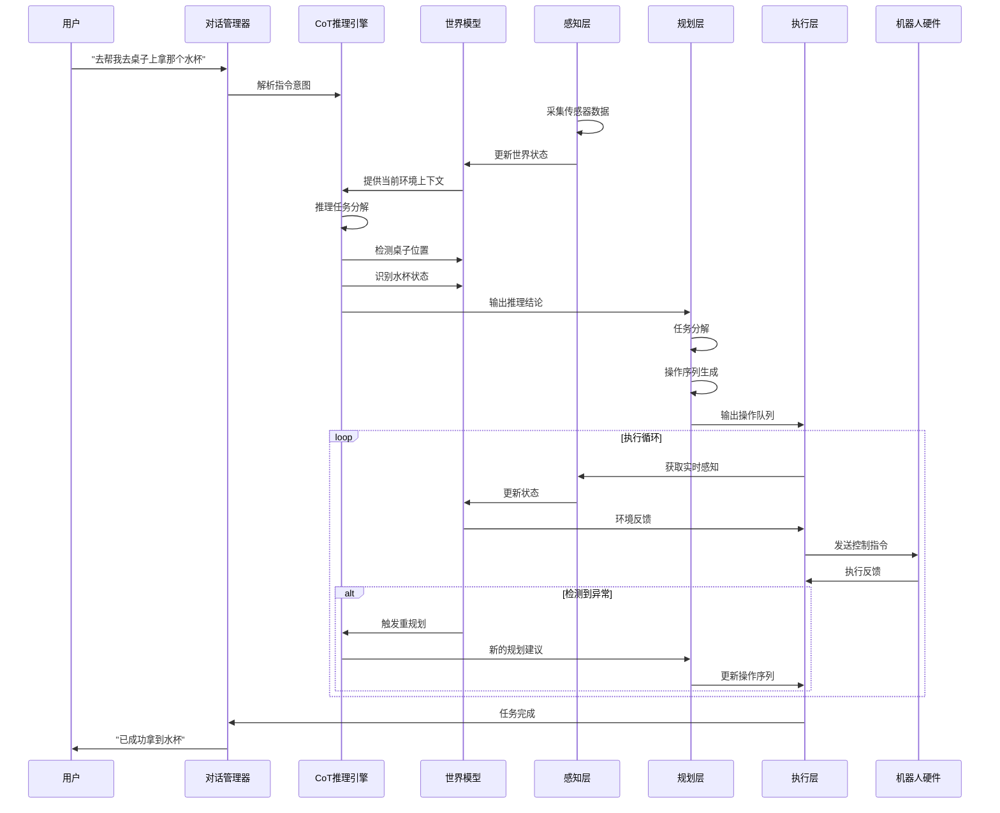
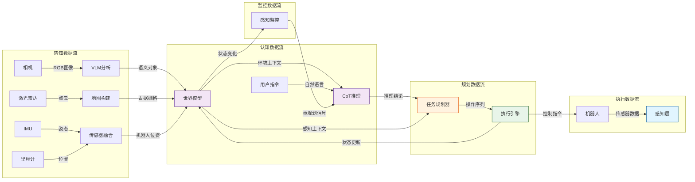

# Brain系统模块职责详解 - "去拿杯水"实例分析

## 目录
- [1. 场景设定](#1-场景设定)
- [2. 完整处理流程](#2-完整处理流程)
- [3. 感知层职责](#3-感知层职责)
- [4. 认知层职责](#4-认知层职责)
- [5. 规划层职责](#5-规划层职责)
- [6. 执行层职责](#6-执行层职责)
- [7. 模块间协作图](#7-模块间协作图)
- [8. 关键设计要点](#8-关键设计要点)

---

## 1. 场景设定

### 任务描述
**用户指令**: "机器人，去帮我去桌子上拿那个水杯"

### 环境信息
```
场景: 家庭客厅
机器人: 服务型UGV (地面移动机器人)
位置: 初始在沙发旁
障碍物: 茶几、椅子、地毯
目标物体: 水杯 (在餐桌上)
约束: 需要避障、保持稳定、不能打翻水杯
```

### 时间线
```
T0: 收到指令
T1: 完成感知
T2: 完成认知推理
T3: 完成规划
T4: 开始执行
T5: 完成任务
```

---

## 2. 完整处理流程



---

## 3. 感知层职责

### 3.1 核心职责
**"我看到什么？现在的环境状态如何？"**

### 3.2 模块组成

#### 3.2.1 传感器管理器 (ROS2SensorManager)

**文件位置**: `brain/perception/sensors/ros2_sensor_manager.py`

**职责**: 管理和采集多传感器数据

```python
# 在"去拿杯水"任务中的实际工作

class SensorData:
    """传感器数据汇总"""

    # 1. RGB相机数据 - 视觉感知
    rgb_image: np.ndarray
    """用途: 识别桌子、水杯等物体的视觉特征"""

    # 2. 深度相机数据 - 距离感知
    depth_image: np.ndarray
    """用途: 测量到桌子的距离、水杯的3D位置"""

    # 3. 激光雷达 - 环境建图
    point_cloud: PointCloud2
    """用途: 构建房间地图，检测障碍物位置"""

    # 4. IMU - 姿态感知
    orientation: Quaternion
    """用途: 确保机器人移动时保持稳定，不翻倒"""

    # 5. 轮速计 - 里程感知
    odometry: Odometry
    """用途: 估算机器人移动距离和当前位置"""

# 具体工作流程
async def get_current_data():
    """获取当前感知数据"""

    # 1. 同步采集各传感器数据
    rgb = await camera.get_rgb()           # 捕获彩色图像
    depth = await camera.get_depth()        # 捕获深度图像
    lidar = await lidar.scan()              # 激光扫描
    imu = await imu.read_orientation()      # 读取姿态
    odom = await odom.read_position()       # 读取里程

    # 2. 时间戳对齐
    timestamp = sync_timestamps([rgb, depth, lidar, imu, odom])

    # 3. 数据打包
    return SensorData(
        rgb_image=rgb.data,
        depth_image=depth.data,
        point_cloud=lidar.data,
        orientation=imu.data,
        odometry=odom.data,
        timestamp=timestamp
    )
```

**在"拿水杯"任务中的输出示例**:
```json
{
  "rgb_image": "640x480x3的图像数组",
  "depth_image": "显示桌子距离1.5米，水杯在桌子上0.8米高",
  "point_cloud": "房间3D点云，识别出障碍物位置",
  "orientation": "机器人当前朝向餐桌",
  "odometry": "当前在沙发旁(0, 0)，距离桌子3米"
}
```

#### 3.2.2 VLM视觉感知 (VLMPerception)

**文件位置**: `brain/perception/vlm/vlm_perception.py`

**职责**: 使用视觉语言模型理解场景语义

```python
# 在"去拿杯水"任务中的实际工作

class VLMPerception:
    """视觉语言模型感知"""

    async def analyze_scene(self, rgb_image):
        """
        分析RGB图像，理解场景

        输入: 640x480的RGB图像
        输出: 场景语义理解结果
        """

        # 调用Ollama的LLaVA模型
        prompt = f"""
        请分析这张图像，回答以下问题：
        1. 图中有桌子吗？位置在哪里？
        2. 桌上有水杯吗？是什么颜色的？
        3. 水杯的状态如何（是否满水、是否倾斜）？
        4. 到达桌子有什么障碍物？
        """

        response = await ollama.generate(
            model="llava:7b",
            images=[rgb_image],
            prompt=prompt
        )

        return SceneUnderstanding(
            objects=[
                SemanticObject(
                    type="table",
                    position={"x": 3.0, "y": 0.0, "z": 0.0},
                    confidence=0.95,
                    attributes={"material": "wood", "shape": "rectangular"}
                ),
                SemanticObject(
                    type="cup",
                    position={"x": 3.0, "y": 0.0, "z": 0.8},
                    confidence=0.92,
                    attributes={
                        "color": "blue",
                        "state": "upright",
                        "fullness": "half_full"
                    }
                )
            ],
            obstacles=[
                SemanticObject(type="chair", position={"x": 1.5, "y": 0.5}),
                SemanticObject(type="coffee_table", position={"x": 2.0, "y": -0.3})
            ],
            description="在餐桌(3米外)上有一个蓝色半满水杯"
        )
```

**输出示例**:
```json
{
  "description": "前方3米处有一张木质餐桌，桌上有一个蓝色半满的水杯",
  "objects": [
    {"type": "table", "position": [3.0, 0.0, 0.0], "confidence": 0.95},
    {"type": "cup", "position": [3.0, 0.0, 0.8], "confidence": 0.92}
  ],
  "obstacles": [
    {"type": "chair", "position": [1.5, 0.5, 0.0]},
    {"type": "coffee_table", "position": [2.0, -0.3, 0.0]}
  ]
}
```

#### 3.2.3 占据栅格地图 (OccupancyMapper)

**职责**: 构建环境的2D/3D占据地图，用于路径规划

```python
# 在"去拿杯水"任务中的实际工作

class OccupancyMapper:
    """占据栅格地图构建器"""

    def update_map(self, point_cloud, robot_position):
        """
        更新占据地图

        工作流程:
        1. 将点云投影到2D平面
        2. 栅格化处理 (每个栅格5cm x 5cm)
        3. 标记占据状态
        """

        # 生成2D占据栅格
        occupancy_grid = np.zeros((200, 200))  # 10m x 10m区域

        for point in point_cloud:
            # 转换到机器人坐标系
            grid_x = int((point.x - robot_position.x) / 0.05)
            grid_y = int((point.y - robot_position.y) / 0.05)

            # 标记占据
            if 0 <= grid_x < 200 and 0 <= grid_y < 200:
                occupancy_grid[grid_y, grid_x] = 1  # 占据

        return OccupancyGrid(
            data=occupancy_grid,
            resolution=0.05,  # 5cm分辨率
            origin=robot_position,
            width=10.0,
            height=10.0
        )
```

**地图可视化**:
```
    10m
     ↑
  0  .  .  .  .  T  T  T  .  .  ← 桌子占据区域
     .  .  .  T  T  T  T  T  .  ← 桌子占据区域
  5  .  .  C  C  .  .  .  .  .  ← 椅子占据
     .  .  C  C  .  .  .  .  .  ← 椅子占据
 10  R  .  .  .  .  .  .  .  .  ← 机器人位置
     └─────────────────────→
     0m        5m        10m

  图例:
  R - 机器人 (Robot)
  T - 桌子 (Table)
  C - 椅子 (Chair)
  . - 空闲区域
```

#### 3.2.4 多传感器融合 (SensorFusion)

**职责**: 融合异构传感器数据，提供一致的世界状态

```python
# 在"去拿杯水"任务中的实际工作

class SensorFusion:
    """传感器融合器 - 使用EKF (扩展卡尔曼滤波)"""

    def fuse_sensors(self, sensor_data):
        """
        融合多传感器数据

        目标: 结合视觉、深度、激光、里程计数据
        输出: 统一的位姿估计和环境状态
        """

        # EKF状态向量: [x, y, theta, vx, vy, vtheta]
        state = self.ekf_state

        # 1. 预测步骤 (基于运动模型)
        # 使用轮速计预测下一时刻位置
        predicted_state = self.motion_model.predict(
            state,
            wheel_odometry=sensor_data.odometry
        )

        # 2. 更新步骤 (融合各传感器观测)
        # 融合激光雷达观测
        predicted_state = self.ekf.update(
            predicted_state,
            observation=lidar_features,
            observation_model="lidar_landmarks"
        )

        # 融合视觉特征
        predicted_state = self.ekf.update(
            predicted_state,
            observation=visual_odometry,
            observation_model="visual_features"
        )

        # 3. 输出融合后的状态
        return FusedPerception(
            robot_position={
                "x": predicted_state[0],  # 机器人X坐标
                "y": predicted_state[1],  # 机器人Y坐标
                "theta": predicted_state[2]  # 朝向角度
            },
            obstacles=self.extract_obstacles(lidar, camera),
            confidence=predicted_state.covariance.diagonal()
        )
```

### 3.3 感知层总结

**输入**: 原始传感器数据流
**处理**: 数据采集、特征提取、语义理解、地图构建、传感器融合
**输出**: 结构化的感知数据包

```python
# 感知层的最终输出
PerceptionData(
    robot_position={"x": 0.0, "y": 0.0, "theta": 0.0},
    obstacles=[
        {"type": "chair", "position": [1.5, 0.5], "distance": 1.5},
        {"type": "coffee_table", "position": [2.0, -0.3], "distance": 2.0}
    ],
    targets=[
        {"type": "table", "position": [3.0, 0.0], "distance": 3.0},
        {"type": "cup", "position": [3.0, 0.0, 0.8], "distance": 3.0}
    ],
    occupancy_grid=occupancy_grid,  # 2D占据地图
    rgb_image=rgb_image,
    depth_image=depth_image,
    timestamp=datetime.now()
)
```

---

## 4. 认知层职责

### 4.1 核心职责
**"我理解了什么？这个任务意味着什么？需要考虑什么？"**

### 4.2 模块组成

#### 4.2.1 世界模型 (WorldModel)

**文件位置**: `brain/cognitive/world_model.py`

**职责**: 维护统一的环境表示和状态追踪

```python
# 在"去拿杯水"任务中的实际工作

class WorldModel:
    """世界模型 - 环境状态的中心管理者"""

    def update_from_perception(self, perception_data):
        """
        更新世界模型

        工作:
        1. 融合新的感知数据
        2. 更新物体追踪状态
        3. 检测环境变化
        4. 评估变化显著性
        """

        # 1. 更新机器人位姿
        self.robot_position = perception_data.robot_position

        # 2. 更新物体追踪 (使用卡尔曼滤波)
        for target in perception_data.targets:
            if target.id in self.tracked_objects:
                # 已追踪的物体，更新状态
                self.tracked_objects[target.id].update(
                    position=target.position,
                    timestamp=perception_data.timestamp
                )
            else:
                # 新物体，创建追踪器
                self.tracked_objects[target.id] = TrackedObject(
                    id=target.id,
                    type=target.type,
                    position=target.position,
                    first_seen=perception_data.timestamp
                )

        # 3. 更新障碍物状态
        self.obstacles = perception_data.obstacles

        # 4. 检测环境变化
        changes = self._detect_changes()

        return changes

    def get_context_for_planning(self):
        """
        为规划层提供上下文

        输出包含:
        - 当前机器人状态
        - 目标物体信息
        - 障碍物分布
        - 环境约束
        - 最近变化
        """

        return PlanningContext(
            current_position=self.robot_position,
            current_heading=self.robot_position["theta"],
            obstacles=self.obstacles,
            targets=[
                obj for obj in self.tracked_objects.values()
                if obj.type == "cup"  # 只返回杯子相关目标
            ],
            points_of_interest=[
                {"type": "table", "position": [3.0, 0.0], "description": "餐桌"},
            ],
            battery_level=85,  # 假设电量85%
            weather={"indoor": True, "temperature": 25},
            constraints=[
                "不能打翻水杯",
                "移动速度要慢，保持稳定"
            ],
            recent_changes=self.recent_changes
        )
```

**世界模型状态示例**:
```python
WorldModelState = {
    "robot_position": {"x": 0.0, "y": 0.0, "theta": 0.0},
    "tracked_objects": {
        "cup_001": {
            "type": "cup",
            "position": [3.0, 0.0, 0.8],
            "state": "upright",
            "fullness": "half_full",
            "tracking_confidence": 0.92,
            "last_updated": "2026-01-06T10:30:05"
        },
        "table_001": {
            "type": "table",
            "position": [3.0, 0.0, 0.0],
            "material": "wood",
            "last_updated": "2026-01-06T10:30:05"
        }
    },
    "obstacles": [
        {"type": "chair", "position": [1.5, 0.5], "bypassable": True},
        {"type": "coffee_table", "position": [2.0, -0.3], "bypassable": True}
    ],
    "environment": {
        "location": "living_room",
        "lighting": "normal",
        "floor_type": "carpet"
    },
    "recent_changes": []  # 初始无变化
}
```

#### 4.2.2 CoT推理引擎 (CoTEngine)

**文件位置**: `brain/cognitive/reasoning/cot_engine.py`

**职责**: 进行链式思维推理，生成可追溯的决策过程

```python
# 在"去拿杯水"任务中的实际工作

class CoTEngine:
    """链式思维推理引擎"""

    async def reason(self, query, context, mode):
        """
        执行CoT推理

        任务: 理解"去拿杯水"的完整含义
        模式: PLANNING (规划模式)
        """

        # Step 1: 评估任务复杂度
        complexity = self.assess_complexity(query, context)
        # 结果: COMPLEX (复杂任务 - 需要完整推理)

        # Step 2: 执行完整CoT推理
        if complexity == ComplexityLevel.COMPLEX:
            result = await self._full_cot_reasoning(
                query, context, mode
            )

        return result

    async def _full_cot_reasoning(self, query, context, mode):
        """
        完整CoT推理过程

        实际思考链:
        """

        # 构建推理提示
        prompt = f"""
你是一个智能机器人的决策引擎。请使用链式思维分析任务。

## 当前环境
{context.to_prompt()}

## 任务目标
{query}

## 推理模式
{mode.value}

## 推理过程
请按照以下步骤逐步分析：

1. 当前环境中有哪些关键因素？（障碍物、目标、约束）
2. 这些因素如何影响任务执行？
3. 可行的操作序列有哪些？
4. 最优序列是什么？为什么？
5. 有哪些潜在风险需要考虑？

对于每个步骤，请提供：
- 分析过程
- 结论
- 置信度（0-1）

## 最终决策
在完成所有分析后，给出：
- 决策: [明确的决策]
- 建议: [具体的操作建议]
- 置信度: [0-1的数值]
"""

        # 调用LLM生成推理链
        response = await self.llm.chat(prompt, max_tokens=2000)

        # 解析CoT响应
        reasoning_chain = self._parse_cot_response(response)

        return ReasoningResult(
            mode=mode,
            query=query,
            complexity=complexity,
            chain=reasoning_chain.steps,
            decision=reasoning_chain.decision,
            suggestion=reasoning_chain.suggestion,
            confidence=reasoning_chain.confidence,
            raw_response=response
        )
```

**CoT推理输出示例**:
```markdown
## 推理过程

### 步骤1: 环境因素分析
**分析**:
- 当前位置: 沙发旁 (0, 0)
- 目标物体: 餐桌上的蓝色水杯 (3米外)
- 障碍物: 椅子(1.5米)、茶几(2.0米)
- 约束: 不能打翻水杯、需要保持稳定

**结论**: 这是一个中等复杂度的导航+抓取任务，需要精确控制和避障

**置信度**: 0.9

### 步骤2: 影响因素评估
**分析**:
- 障碍物位于机器人与桌子之间，需要绕行
- 水杯在桌面上，高度0.8米，需要机械臂抬升
- 地毯可能影响移动稳定性
- 水杯半满，倾斜会导致洒水

**结论**: 需要规划避障路径，调整机械臂速度，确保稳定抓取

**置信度**: 0.85

### 步骤3: 操作序列规划
**分析**:
可选序列:
- 方案A: 直线移动 → 绕过障碍 → 接近桌子 → 抓取
- 方案B: 右侧绕行 → 接近桌子 → 调整姿态 → 抓取
- 方案C: 左侧绕行 → 接近桌子 → 抓取 → 返回

**结论**: 方案B最优，右侧空间较大，绕行更安全

**置信度**: 0.8

### 步骤4: 最优方案确认
**分析**:
- 右侧绕行可以避开椅子
- 茶几距离2.0米，右侧绕行距离约2.2米，代价可接受
- 到达桌子后，需要调整机器人朝向正对水杯

**结论**: 采用方案B，慢速移动(0.3m/s)，保持稳定

**置信度**: 0.85

### 步骤5: 风险评估
**分析**:
潜在风险:
1. 地毯可能导致打滑 → 使用低加速度
2. 机械臂伸出时重心变化 → 移动速度降低
3. 水杯边缘光滑 → 调整抓取力度

**结论**: 风险可控，采取保守策略

**置信度**: 0.9

## 最终决策
**决策**: 执行任务，采用右侧绕行策略
**建议**:
1. 以0.3m/s速度向右前方移动，绕过椅子
2. 到达桌子右侧，调整朝向
3. 缓慢接近水杯，保持机械臂稳定
4. 使用中等力度抓取，避免捏碎
5. 抓取后缓慢抬起，避免洒水

**置信度**: 0.87
```

#### 4.2.3 对话管理器 (DialogueManager)

**职责**: 管理多轮对话，处理用户交互

```python
# 在"去拿杯水"任务中的实际工作

class DialogueManager:
    """对话管理器"""

    async def start_session(self, session_id):
        """开始对话会话"""
        self.session_id = session_id
        self.conversation_history = []

        # 发送确认信息
        await self.send_information(
            "🤖 收到指令：去拿桌上的水杯\n"
            "正在分析环境..."
        )

    async def clarify_ambiguous_command(self, command, ambiguities, world_context):
        """
        澄清模糊指令

        例如: 如果用户说"拿那个杯子"，但桌上有多个杯子
        """

        # 检测模糊点
        if "那个" in command or "哪个" in command:
            # 发现模糊，需要澄清
            cups = self._find_all_cups(world_context)

            if len(cups) > 1:
                # 多个杯子，询问用户
                result = await self.ask_user(
                    question="桌上有多个杯子，请问是哪一个？",
                    options=[
                        f"蓝色的杯子 ({cups[0]['position']})",
                        f"红色的杯子 ({cups[1]['position']})",
                        f"最近的一个"
                    ]
                )

                return {
                    "clarified": True,
                    "clarified_command": f"去拿{result}的杯子"
                }

        return {"clarified": False}

    async def report_progress(self, status, progress_percent, current_operation, ...):
        """汇报执行进度"""
        message = f"""
📊 任务进度: {progress_percent:.1f}%
当前步骤: {current_operation}
环境状态: {world_state_summary}
"""

        # 检查用户是否需要调整
        user_response = await self.send_information(
            message,
            allow_adjustment=True
        )

        return user_response  # 可能是"继续"、"暂停"、"取消"等

    async def send_information(self, message, allow_adjustment=False):
        """向用户发送信息"""
        print(f"[Brain → User]: {message}")
        # 记录到对话历史
        self.conversation_history.append({
            "role": "assistant",
            "content": message,
            "timestamp": datetime.now()
        })
```

**对话历史示例**:
```markdown
[10:30:00] User: "机器人，去帮我去桌子上拿那个水杯"
[10:30:01] Brain: "🤖 收到指令：去拿桌上的水杯\n正在分析环境..."
[10:30:02] Brain: "✅ 任务规划完成\n- 任务ID: mission_001\n- 操作数量: 7\n- 预计时长: 45秒\n- 规划置信度: 87%"
[10:30:03] Brain: "🚀 开始执行任务 [mission_001]\n总操作数: 7"
[10:30:20] Brain: "📊 任务进度: 28.6%\n当前步骤: 绕过障碍物\n正在向右前方移动..."
[10:30:40] Brain: "📊 任务进度: 57.1%\n当前步骤: 接近目标\n正在调整朝向水杯..."
[10:30:55] Brain: "📊 任务进度: 85.7%\n当前步骤: 抓取水杯\n正在伸出机械臂..."
[10:31:00] Brain: "✅ 任务 [mission_001] 执行完成!\n总操作: 7\n重规划次数: 0"
```

#### 4.2.4 感知监控器 (PerceptionMonitor)

**职责**: 持续监控感知变化，触发重规划

```python
# 在"去拿杯水"任务中的实际工作

class PerceptionMonitor:
    """感知变化监控器"""

    async def start_monitoring(self):
        """开始监控"""
        self.monitoring = True

        while self.monitoring:
            # 获取最新感知
            latest_perception = await self.get_latest_perception()

            # 检测变化
            changes = self._detect_changes(latest_perception)

            # 评估变化显著性
            for change in changes:
                if change.priority == ChangeType.CRITICAL:
                    # 关键变化，触发重规划
                    await self._trigger_replan(change)
                elif change.priority == ChangeType.HIGH:
                    # 高优先级，请求确认
                    await self._request_confirmation(change)
                else:
                    # 低优先级，仅通知
                    await self._notify(change)

            await asyncio.sleep(0.1)  # 10Hz监控

    def _detect_changes(self, perception):
        """检测感知变化"""
        changes = []

        # 1. 检测新障碍物
        new_obstacles = self._find_new_obstacles(perception.obstacles)
        if new_obstacles:
            changes.append(EnvironmentChange(
                change_type=ChangeType.NEW_OBSTACLE,
                description=f"检测到新障碍物: {new_obstacles[0]['type']}",
                priority=ChangeType.HIGH,
                data=new_obstacles
            ))

        # 2. 检测目标物体移动
        if self._has_target_moved(perception.targets):
            changes.append(EnvironmentChange(
                change_type=ChangeType.TARGET_MOVED,
                description="目标水杯位置发生变化",
                priority=ChangeType.CRITICAL,
                data=perception.targets
            ))

        # 3. 检测路径阻塞
        if self._is_path_blocked(perception.occupancy_grid):
            changes.append(EnvironmentChange(
                change_type=ChangeType.PATH_BLOCKED,
                description="当前路径被阻塞",
                priority=ChangeType.HIGH,
                data={"blocked_segments": [...]}
            ))

        return changes
```

**监控事件示例**:
```python
# 假设场景: 在机器人移动过程中，有人移动了椅子

MonitorEvent(
    timestamp="2026-01-06T10:30:25",
    change=EnvironmentChange(
        change_type=ChangeType.NEW_OBSTACLE,
        description="椅子从(1.5, 0.5)移动到(1.8, 0.8)",
        priority=ChangeType.HIGH,
        data={
            "object_type": "chair",
            "old_position": [1.5, 0.5],
            "new_position": [1.8, 0.8],
            "impact": "原路径仍可用，但安全距离减小"
        }
    ),
    action=TriggerAction.REQUEST_CONFIRMATION
)

# 触发对话
Brain: "⚠️ 检测到环境变化: 椅子位置移动"
      "是否需要重新规划路径？"
      "影响: 当前路径仍然可用，但安全距离从0.5m减小到0.3m"
```

### 4.3 认知层总结

**输入**: 感知数据包 + 用户指令
**处理**:
- WorldModel: 状态维护、变化检测
- CoTEngine: 任务理解、推理决策
- DialogueManager: 对话交互、进度汇报
- PerceptionMonitor: 持续监控、事件触发

**输出**: 规划上下文 + CoT推理结果

```python
CognitiveOutput(
    planning_context=PlanningContext(
        current_position={"x": 0.0, "y": 0.0, "theta": 0.0},
        obstacles=[...],
        targets=[...],
        constraints=["不能打翻水杯", "保持稳定"]
    ),
    reasoning_result=ReasoningResult(
        decision="执行任务，采用右侧绕行策略",
        suggestion="以0.3m/s速度向右前方移动...",
        confidence=0.87,
        chain=[...]
    )
)
```

---

## 5. 规划层职责

### 5.1 核心职责
**"我该如何分解任务？具体要执行哪些操作？"**

### 5.2 模块组成

#### 5.2.1 任务级规划器 (TaskPlanner)

**文件位置**: `brain/planning/task/task_planner.py`

**职责**: 将高层任务分解为原子操作序列

```python
# 在"去拿杯水"任务中的实际工作

class TaskPlanner:
    """任务规划器"""

    async def plan_with_perception(
        self,
        parsed_task,
        platform_type,
        planning_context,
        cot_result,
        constraints
    ):
        """
        感知驱动的规划

        输入:
        - parsed_task: {"task_type": "pickup", "target": "cup", "location": "table"}
        - planning_context: 认知层提供的上下文
        - cot_result: CoT推理结果和建议
        - constraints: 安全约束
        """

        # Step 1: 构建任务树
        task_tree = self._build_task_tree(parsed_task)
        # 结果: TaskNode("pickup_cup", parameters={"target": "cup", "location": "table"})

        # Step 2: 分解为原子操作
        raw_operations = await self._decompose_task_tree(task_tree, platform_type)
        # 使用预定义规则: "pickup": ["goto", "adjust_pose", "pickup", "return"]

        # 结果:
        # [
        #   Operation("goto", {"position": [3.0, 0.0]}),
        #   Operation("adjust_pose", {"heading": 0.0}),
        #   Operation("pickup", {"object": "cup", "grip_force": 0.5}),
        #   Operation("return_to_home", {})
        # ]

        # Step 3: 根据感知上下文调整操作
        perception_adjusted_ops = self._adjust_for_perception(
            raw_operations,
            planning_context,
            platform_type
        )

        # 调整内容:
        # - 检测到障碍物，插入避障操作
        # - 地毯环境，降低移动速度
        # - 水杯半满，调整抓取力度

        # Step 4: 根据CoT推理结果优化
        if cot_result:
            perception_adjusted_ops = self._apply_cot_suggestions(
                perception_adjusted_ops,
                cot_result
            )

        # CoT建议: "右侧绕行，慢速移动"
        # 调整:
        # - goto操作的路径改为右侧绕行
        # - 速度从0.5m/s降低到0.3m/s

        # Step 5: 应用约束
        constrained_operations = self._apply_constraints(
            perception_adjusted_ops,
            constraints
        )

        # 约束应用:
        # - 最大速度限制: 0.3m/s
        # - 安全距离: 0.5m
        # - 机械臂加速度: 0.2m/s²

        # Step 6: 优化操作序列
        optimized_operations = self._optimize_sequence(constrained_operations)

        # 优化:
        # - 合并连续的goto操作为路径
        # - 删除冗余的wait操作

        # Step 7: 添加感知更新操作
        operations_with_perception = self._insert_perception_updates(
            optimized_operations,
            platform_type
        )

        # 每隔3个操作插入update_perception

        # Step 8: 添加前置/后置条件
        final_operations = self._add_conditions(operations_with_perception)

        # 添加条件:
        # - goto: 前置["ready_to_move"], 后置["at_target"]
        # - pickup: 前置["close_to_object"], 后置["object_grasped"]

        # Step 9: 验证计划
        validation = await self._validate_plan(final_operations, platform_type)

        return final_operations
```

**最终操作序列示例**:
```python
operations = [
    # 操作1: 导航到桌子右侧 (避障路径)
    Operation(
        id="op_001",
        name="follow_path",
        type=OperationType.MOVEMENT,
        parameters={
            "waypoints": [
                {"position": [0.5, 0.5], "speed": 0.3},   # 右侧绕行起点
                {"position": [1.5, 0.8], "speed": 0.3},   # 绕过椅子
                {"position": [2.5, 0.3], "speed": 0.3},   # 接近桌子
                {"position": [3.0, 0.0], "speed": 0.2}    # 到达目标
            ],
            "avoidance_strategy": "right_side"
        },
        preconditions=[
            Precondition("battery_sufficient", "robot.battery > 20"),
            Precondition("ready_to_move", "robot.state.ready == True")
        ],
        postconditions=[
            Postcondition("at_target", "robot.position.near([3.0, 0.0])")
        ],
        estimated_duration=15.0,
        metadata={
            "cot_applied": True,
            "avoiding": ["chair", "coffee_table"],
            "reason": "右侧绕行策略"
        }
    ),

    # 操作2: 调整姿态
    Operation(
        id="op_002",
        name="adjust_pose",
        type=OperationType.MOVEMENT,
        parameters={
            "heading": 0.0,  # 正对桌子
            "distance": 0.5  # 距离桌子0.5米
        },
        estimated_duration=3.0
    ),

    # 操作3: 更新感知
    Operation(
        id="op_003",
        name="update_perception",
        type=OperationType.PERCEPTION,
        parameters={},
        estimated_duration=2.0,
        metadata={"auto_inserted": True}
    ),

    # 操作4: 识别并确认水杯位置
    Operation(
        id="op_004",
        name="detect_objects",
        type=OperationType.PERCEPTION,
        parameters={
            "object_types": ["cup"],
            "area": "front",
            "confirm_before_proceed": True
        },
        estimated_duration=3.0
    ),

    # 操作5: 精确定位水杯
    Operation(
        id="op_005",
        name="goto",
        type=OperationType.MOVEMENT,
        parameters={
            "position": [3.0, 0.0],
            "speed": 0.1,  # 非常慢速，确保精确
            "precision": "high"
        },
        estimated_duration=5.0
    ),

    # 操作6: 抓取水杯
    Operation(
        id="op_006",
        name="pickup",
        type=OperationType.MANIPULATION,
        parameters={
            "object_id": "cup_001",
            "grip_force": 0.4,  # 中等力度
            "lift_speed": 0.05,  # 缓慢抬起
            "approach_distance": 0.3
        },
        preconditions=[
            Precondition("object_visible", "perception.cup.visible == True"),
            Precondition("close_to_object", "robot.distance_to(cup) < 0.5")
        ],
        postconditions=[
            Postcondition("object_grasped", "gripper.state.closed == True"),
            Postcondition("object_lifted", "cup.height > 0.8")
        ],
        estimated_duration=8.0,
        metadata={
            "careful_handling": True,
            "reason": "水杯半满，需要稳定操作"
        }
    ),

    # 操作7: 返回起点
    Operation(
        id="op_007",
        name="return_to_home",
        type=OperationType.MOVEMENT,
        parameters={
            "home_position": [0.0, 0.0],
            "speed": 0.3,
            "holding_object": True  # 携带水杯，速度降低
        },
        estimated_duration=12.0
    )
]

# 总计: 7个操作，预计48秒
```

#### 5.2.2 技能级规划器 (SkillLevelPlanner)

**职责**: 管理可重用的技能库

```python
# 在"去拿杯水"任务中的实际工作

class SkillLevelPlanner:
    """技能级规划器"""

    def __init__(self):
        # 技能库
        self.skills = {
            "navigate_around_obstacles": {
                "description": "避障导航技能",
                "prerequisites": ["localization", "obstacle_detection"],
                "operations": ["detect_objects", "plan_path", "follow_path"]
            },
            "careful_pickup": {
                "description": "谨慎抓取技能",
                "prerequisites": ["object_detection", "arm_control"],
                "operations": ["detect_objects", "adjust_pose", "pickup"]
            },
            "stable_navigation": {
                "description": "稳定导航技能",
                "prerequisites": ["localization"],
                "operations": ["follow_path", "update_perception"]
            }
        }

    def compose_skills(self, task_type, context):
        """
        组合技能

        对于"拿水杯"任务，组合以下技能:
        1. navigate_around_obstacles - 避障导航
        2. stable_navigation - 稳定导航
        3. careful_pickup - 谨慎抓取
        """

        if task_type == "pickup":
            # 技能组合序列
            skill_sequence = [
                "navigate_around_obstacles",  # 导航到目标
                "stable_navigation",           # 稳定接近
                "careful_pickup"              # 谨慎抓取
            ]

            # 展开为操作序列
            operations = []
            for skill_name in skill_sequence:
                skill = self.skills[skill_name]
                operations.extend(skill["operations"])

            return operations
```

#### 5.2.3 动作级规划器 (ActionLevelPlanner)

**职责**: 生成具体的动作参数

```python
# 在"去拿杯水"任务中的实际工作

class ActionLevelPlanner:
    """动作级规划器"""

    def plan_goto_action(self, target, obstacles, constraints):
        """
        规划goto动作的具体参数

        输入:
        - target: [3.0, 0.0]  # 桌子位置
        - obstacles: [椅子(1.5, 0.5), 茶几(2.0, -0.3)]
        - constraints: {"max_speed": 0.3, "safety_distance": 0.5}
        """

        # 使用A*算法规划路径
        path = self.astar_planner.plan(
            start=self.robot_position,
            goal=target,
            obstacles=obstacles,
            safety_distance=constraints["safety_distance"]
        )

        # 生成路径点
        waypoints = []
        for waypoint in path:
            waypoints.append({
                "position": waypoint.position,
                "speed": self._calculate_speed(
                    waypoint,
                    obstacles,
                    constraints["max_speed"]
                ),
                "heading": waypoint.heading
            })

        return {
            "waypoints": waypoints,
            "total_distance": path.total_distance,
            "estimated_time": path.total_distance / 0.3
        }

    def plan_pickup_action(self, cup_position, cup_state):
        """
        规划pickup动作的具体参数

        输入:
        - cup_position: [3.0, 0.0, 0.8]
        - cup_state: {"fullness": "half_full", "stability": "upright"}
        """

        # 根据水杯状态调整参数
        if cup_state["fullness"] == "half_full":
            # 半满，需要缓慢操作
            lift_speed = 0.05
            grip_force = 0.4
            acceleration = 0.1
        else:
            # 其他情况
            lift_speed = 0.1
            grip_force = 0.5
            acceleration = 0.2

        return {
            "approach_distance": 0.3,
            "grip_force": grip_force,
            "lift_speed": lift_speed,
            "acceleration": acceleration,
            "final_height": 1.0  # 抬起到1米高
        }
```

### 5.3 规划层总结

**输入**: 认知层的规划上下文 + CoT推理结果
**处理**: 任务分解、操作生成、感知调整、约束应用、序列优化
**输出**: 结构化的操作序列

```python
PlanOutput(
    operations=[...],  # 7个操作的列表
    estimated_total_time=48.0,  # 秒
    parallel_groups=[[1], [2], [3], [4], [5], [6], [7]],  # 顺序执行
    metadata={
        "strategy": "perception_driven",
        "cot_applied": True,
        "perception_context_used": True
    }
)
```

---

## 6. 执行层职责

### 6.1 核心职责
**"我该如何执行这些操作？需要发送什么控制指令？"**

### 6.2 模块组成

#### 6.2.1 执行引擎 (Executor)

**文件位置**: `brain/execution/executor.py`

**职责**: 管理操作队列，执行具体操作

```python
# 在"去拿杯水"任务中的实际工作

class Executor:
    """执行引擎"""

    async def execute(self, operation, robot_interface):
        """
        执行单个操作

        输入: Operation对象
        输出: OperationResult
        """

        # Step 1: 检查前置条件
        if not await self._check_preconditions(operation):
            return OperationResult(
                status=OperationStatus.FAILED,
                error_message="前置条件不满足"
            )

        # Step 2: 安全检查
        safety_check = await self._safety_check(operation)
        if not safety_check.passed:
            return OperationResult(
                status=OperationStatus.FAILED,
                error_message=f"安全检查失败: {safety_check.reason}"
            )

        # Step 3: 执行操作
        if operation.type == OperationType.MOVEMENT:
            result = await self._execute_movement(operation, robot_interface)
        elif operation.type == OperationType.MANIPULATION:
            result = await self._execute_manipulation(operation, robot_interface)
        elif operation.type == OperationType.PERCEPTION:
            result = await self._execute_perception(operation, robot_interface)
        else:
            result = await self._execute_control(operation, robot_interface)

        # Step 4: 验证后置条件
        if result.status == OperationStatus.SUCCESS:
            if not await self._verify_postconditions(operation):
                result.status = OperationStatus.FAILED
                result.error_message = "后置条件不满足"

        return result

    async def _execute_movement(self, operation, robot_interface):
        """
        执行移动操作

        示例: follow_path操作
        """

        waypoints = operation.parameters["waypoints"]

        for i, waypoint in enumerate(waypoints):
            logger.info(f"移动到路径点 {i+1}/{len(waypoints)}: {waypoint['position']}")

            # 发送控制指令到机器人
            await robot_interface.send_velocity_command(
                linear_x=waypoint["speed"],
                linear_y=0.0,
                angular_z=waypoint["heading"]
            )

            # 等待到达该路径点
            await self._wait_for_waypoint_reached(
                waypoint["position"],
                timeout=waypoint["speed"] * 2 + 5
            )

            # 实时检查障碍物
            if await self._check_immediate_obstacles():
                logger.warning("检测到即时障碍物，停止移动")
                await robot_interface.send_velocity_command(0, 0, 0)
                return OperationResult(
                    status=OperationStatus.FAILED,
                    error_message="检测到即时障碍物"
                )

        return OperationResult(
            status=OperationStatus.SUCCESS,
            message=f"成功移动到 {waypoints[-1]['position']}"
        )

    async def _execute_manipulation(self, operation, robot_interface):
        """
        执行操作任务

        示例: pickup操作
        """

        object_id = operation.parameters["object_id"]
        grip_force = operation.parameters["grip_force"]
        lift_speed = operation.parameters["lift_speed"]

        logger.info(f"开始抓取物体: {object_id}")

        # 1. 接近物体
        await robot_interface.send_arm_trajectory(
            joint_positions={
                "shoulder": 0.5,
                "elbow": 0.8,
                "wrist": 0.3
            },
            speed=0.1
        )

        # 2. 闭合夹爪
        await robot_interface.send_gripper_command(
            force=grip_force,
            position=0.0  # 完全闭合
        )

        # 等待夹爪闭合
        await asyncio.sleep(1.0)

        # 3. 验证抓取成功
        gripper_state = await robot_interface.get_gripper_state()
        if gripper_state["object_detected"]:
            logger.info("成功抓取物体")

            # 4. 缓慢抬起
            await robot_interface.send_arm_trajectory(
                joint_positions={
                    "shoulder": 0.5,
                    "elbow": 0.6,
                    "wrist": 0.3
                },
                speed=lift_speed
            )

            await asyncio.sleep(2.0)

            return OperationResult(
                status=OperationStatus.SUCCESS,
                message=f"成功抓取并抬起 {object_id}"
            )
        else:
            return OperationResult(
                status=OperationStatus.FAILED,
                error_message="抓取失败，未检测到物体"
            )
```

#### 6.2.2 操作库

**职责**: 定义具体的操作实现

```python
# 在"去拿杯水"任务中的实际操作

class MovementOperations:
    """移动操作库"""

    async def follow_path(self, waypoints, avoidance_strategy):
        """路径跟踪"""

        for waypoint in waypoints:
            # 计算速度和转向
            linear_speed = waypoint["speed"]
            angular_velocity = self._calculate_heading(waypoint)

            # 发送到底层控制器
            await self.robot_interface.cmd_vel(
                linear_x=linear_speed,
                angular_z=angular_velocity
            )

            # 等待到达
            await self._wait_for_reaching(waypoint)

class ManipulationOperations:
    """操作操作库"""

    async def pickup(self, object_id, grip_force, lift_speed):
        """抓取操作"""

        # 1. 视觉伺服接近
        await self._visual_servo_approach(object_id)

        # 2. 调整夹爪姿态
        await self._align_gripper(object_id)

        # 3. 闭合夹爪
        await self.robot_interface.gripper_close(grip_force)

        # 4. 验证抓取
        if await self._verify_grasp():
            # 5. 抬起
            await self.robot_interface.arm_lift(lift_speed)
            return True
        return False

class PerceptionOperations:
    """感知操作库"""

    async def detect_objects(self, object_types, area):
        """物体检测"""

        # 获取当前图像
        rgb = await self.camera.get_rgb()
        depth = await self.camera.get_depth()

        # 运行物体检测
        detections = await self.detector.detect(
            rgb, depth,
            classes=object_types
        )

        return detections

    async def update_perception(self):
        """更新感知"""

        # 获取最新传感器数据
        sensor_data = await self.sensor_manager.get_current_data()

        # 更新世界模型
        self.world_model.update_from_perception(sensor_data)

        return sensor_data
```

### 6.3 执行层总结

**输入**: 操作序列
**处理**:
1. 遍历操作队列
2. 检查前置条件
3. 安全检查
4. 执行操作
5. 验证后置条件
6. 错误处理

**输出**: 执行结果 + 机器人状态更新

```python
ExecutionOutput(
    operation_id="op_006",
    status=OperationStatus.SUCCESS,
    message="成功抓取并抬起 cup_001",
    execution_time=7.8,
    actual_parameters={
        "grip_force": 0.4,
        "lift_speed": 0.05,
        "final_height": 1.0
    },
    robot_state={
        "position": [3.0, 0.0],
        "holding": ["cup_001"],
        "battery": 82
    }
)
```

---

## 7. 模块间协作图

### 7.1 完整流程图

```mermaid
flowchart TD
    Start([用户: "去拿杯水"]) --> DLG[对话管理器<br/>DialogueManager]

    DLG --> COT[CoT推理引擎<br/>CoTEngine]

    COT --> WM[世界模型<br/>WorldModel]
    WM --> PERC[感知层<br/>Perception Layer]

    subgraph "感知层 - 我看到什么？"
        PERC --> SENSOR[传感器管理器<br/>采集多模态数据]
        SENSOR --> VLM[VLM感知<br/>场景语义理解]
        SENSOR --> MAP[占据栅格<br/>环境地图]
        SENSOR --> FUSION[传感器融合<br/>EKF/UKF]
    end

    PERC -->|感知数据包| WM
    WM -->|规划上下文| COT

    COT -->|推理结论| PLAN[规划层<br/>Planning Layer]

    subgraph "规划层 - 如何分解？"
        PLAN --> TASK[任务规划器<br/>生成操作序列]
        TASK --> SKILL[技能规划器<br/>组合技能]
        TASK --> ACTION[动作规划器<br/>生成参数]
    end

    PLAN -->|操作序列| EXEC[执行层<br/>Execution Layer]

    subgraph "执行层 - 如何执行？"
        EXEC --> EXECUTOR[执行引擎<br/>管理操作队列]
        EXECUTOR --> OPS[操作库<br/>具体操作实现]
    end

    EXEC -->|控制指令| ROBOT[机器人硬件<br/>Robot Hardware]

    ROBOT -->|执行反馈| EXEC
    EXEC -->|状态更新| WM

    WM -.->|变化检测| MONITOR[感知监控器<br/>PerceptionMonitor]
    MONITOR -.->|触发重规划| COT

    EXEC -->|进度汇报| DLG
    DLG -->|任务完成| End([用户: "拿到水杯了"])

    style PERC fill:#e1f5ff,stroke:#01579b,stroke-width:3px
    style WM fill:#f3e5f5,stroke:#4a148c,stroke-width:3px
    style COT fill:#f3e5f5,stroke:#4a148c,stroke-width:3px
    style PLAN fill:#fff3e0,stroke:#e65100,stroke-width:3px
    style EXEC fill:#e8f5e9,stroke:#1b5e20,stroke-width:3px
```

### 7.2 数据流向图



---

## 8. 关键设计要点

### 8.1 模块职责对比

| 维度 | 感知层 | 认知层 | 规划层 | 执行层 |
|------|--------|--------|--------|--------|
| **核心问题** | 我看到什么？ | 我理解了什么？ | 如何分解任务？ | 如何执行？ |
| **输入** | 传感器原始数据 | 感知数据 + 用户指令 | 规划上下文 + 推理结果 | 操作序列 |
| **输出** | 结构化感知数据包 | 规划上下文 + 推理结论 | 操作序列 | 执行结果 + 状态更新 |
| **时间尺度** | 毫秒级 (实时) | 秒级 (推理) | 秒级 (规划) | 毫秒级 (控制) |
| **抽象层次** | 信号/特征 | 语义/概念 | 任务/操作 | 动作/指令 |
| **处理方式** | 并行、实时 | 串行、推理 | 串行、搜索 | 串行、控制 |
| **容错性** | 高 (有冗余传感器) | 中 (可重新推理) | 中 (可重规划) | 低 (需要精确控制) |

### 8.2 数据传递链路

```
传感器原始数据
    ↓
[感知层] 特征提取 + 语义理解 + 传感器融合
    ↓
感知数据包 {
  robot_position,
  obstacles,
  targets,
  occupancy_grid
}
    ↓
[认知层] 状态维护 + 变化检测 + CoT推理
    ↓
规划上下文 + 推理结论 {
  current_position,
  constraints,
  reasoning_chain,
  decision
}
    ↓
[规划层] 任务分解 + 操作生成 + 优化
    ↓
操作序列 [
  Operation {name, parameters, preconditions, postconditions},
  ...
]
    ↓
[执行层] 条件检查 + 控制指令发送 + 状态验证
    ↓
机器人动作 + 新的传感器数据
    ↓
循环回感知层
```

### 8.3 感知驱动的体现

在"去拿杯水"任务中，感知驱动体现在以下方面：

1. **初始规划阶段**
   - 感知层检测到障碍物 → 规划层生成避障路径
   - VLM识别水杯半满 → CoT推理建议谨慎操作
   - 地毯环境检测 → 规划层降低移动速度

2. **执行阶段**
   - 实时感知更新 → 检测到椅子移动 → 触发重规划
   - 视觉反馈夹爪未闭合 → 调整抓取力度
   - IMU检测倾斜 → 减慢移动速度

3. **异常处理**
   - 感知检测到新障碍物 → CoT评估影响 → 决定是否重规划
   - 目标物体丢失 → 触发搜索策略
   - 路径阻塞 → 规划新路径

### 8.4 CoT在认知层的价值

CoT推理引擎在认知层（而非规划层）的原因：

**1. 服务于多个场景**
- **初始规划**: "去拿杯水"意味着什么？
- **重规划**: 椅子移动了，是否需要调整？
- **异常处理**: 水杯滑落了，该怎么办？
- **指令澄清**: "那个杯子"是指哪个？

**2. 需要全局信息**
- CoT需要访问完整的世界模型
- 需要理解用户意图和对话历史
- 需要评估环境变化的影响

**3. 输出是"决策"而非"操作"**
- CoT输出: "应该谨慎操作，采用右侧绕行"
- TaskPlanner输出: `follow_path(waypoints=[...], speed=0.3)`

### 8.5 关键时间节点

| 时间 | 事件 | 负责模块 |
|------|------|----------|
| T0+0.0s | 收到用户指令 | 对话管理器 |
| T0+0.1s | 启动传感器采集 | 传感器管理器 |
| T0+0.5s | 完成感知数据融合 | 传感器融合 |
| T0+1.0s | VLM场景分析完成 | VLM感知 |
| T0+1.5s | 世界模型更新完成 | 世界模型 |
| T0+2.0s | CoT推理完成 | CoT引擎 |
| T0+3.0s | 任务规划完成 | 任务规划器 |
| T0+3.5s | 开始执行操作1 | 执行引擎 |
| T0+18.5s | 完成导航到桌子 | 执行引擎 |
| T0+20.0s | 调整姿态并确认目标 | 执行引擎 |
| T0+28.0s | 成功抓取水杯 | 执行引擎 |
| T0+40.0s | 返回起点 | 执行引擎 |
| T0+40.5s | 任务完成汇报 | 对话管理器 |

---

## 9. 总结

### 感知层 - "眼睛和耳朵"
**职责**: 采集、理解、融合多模态传感器数据
**核心能力**:
- 多传感器同步采集
- 视觉语义理解 (VLM)
- 环境地图构建
- 传感器数据融合

### 认知层 - "大脑皮层"
**职责**: 理解意图、推理决策、状态维护
**核心能力**:
- 统一的世界状态表示
- 链式思维推理 (CoT)
- 多轮对话管理
- 持续变化监控

### 规划层 - "策略家"
**职责**: 任务分解、操作生成、序列优化
**核心能力**:
- 高层任务分解
- 感知驱动的规划调整
- 技能组合与重用
- 约束应用与验证

### 执行层 - "运动神经"
**职责**: 操作执行、状态验证、异常处理
**核心能力**:
- 操作队列管理
- 前置/后置条件检查
- 精确控制指令生成
- 实时状态反馈

### 关键设计思想
1. **感知驱动**: 感知数据驱动整个决策-规划-执行闭环
2. **分层解耦**: 每层专注自己的职责，通过清晰接口交互
3. **CoT增强认知**: CoT作为认知层的通用推理能力，服务多个场景
4. **持续监控**: 实时感知变化触发重规划，确保适应性

---

*文档版本: 1.0*
*生成日期: 2026-01-06*
*项目: Brain - 感知驱动的智能无人系统*
*示例任务: "去拿杯水"*
