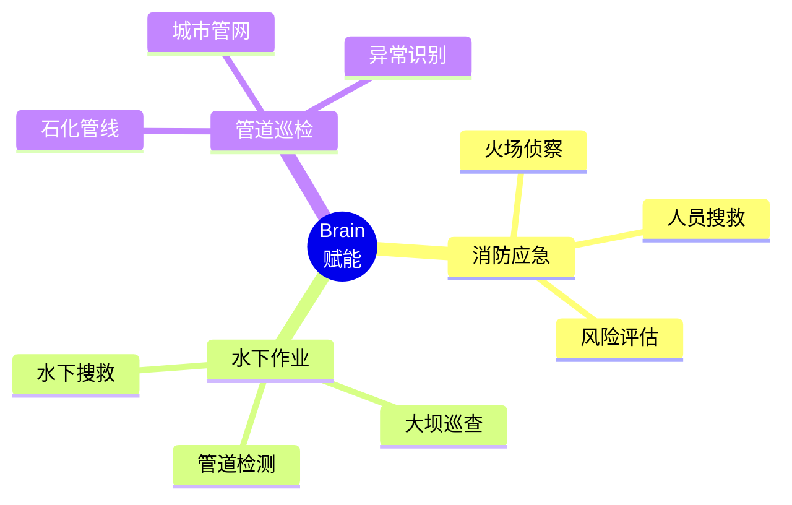

# Brain赋能小微特机器人 - 单页PPT设计方案

## 一页PPT完整布局

### 页面尺寸与风格
- **尺寸**: 16:9 (1920x1080)
- **风格**: 科技感+专业性
- **主色调**: 深蓝 (#1a237e) + 橙色 (#ff6f00) 点缀
- **字体**: 微软雅黑 / 思源黑体

---

## 版面布局图

```
┌─────────────────────────────────────────────────────────────┐
│  标题区 (15%高度)                                            │
│  ┌────────────────────────────────────────────────────┐    │
│  │  Brain赋能小微特机器人 - 感知驱动的智能作业系统     │    │
│  │  从"遥控工具"到"智能伙伴"的进化                     │    │
│  └────────────────────────────────────────────────────┘    │
├───────────────────┬─────────────────────────────────────────┤
│                   │                                         │
│  左侧 (35%)      │  右侧 (65%) - 五层架构图                 │
│  应用场景        │                                         │
│                   │                                         │
│  ┌───────────┐   │  ┌─────────────────────────────────┐    │
│  │ 消防应急  │   │  │         传感器硬件层            │    │
│  │ 🔥 火场  │   │  │  热成像│声呐│气体│激光│RGB    │    │
│  │   侦察    │   │  └─────────────────────────────────┘    │
│  │   评估    │   │              ↕                         │
│  │   搜救    │   │  ┌─────────────────────────────────┐    │
│  └───────────┘   │  │      感知层 (理解环境)           │    │
│                  │  │  多模态融合 │ VLM语义理解        │    │
│  ┌───────────┐   │  │  占据栅格   │ 传感器融合        │    │
│  │ 水下作业  │   │  └─────────────────────────────────┘    │
│  │ 🌊 管道  │   │              ↕                         │
│  │   大坝    │   │  ┌─────────────────────────────────┐    │
│  │   巡检    │   │  │     认知层 (智能决策)            │    │
│  └───────────┘   │  │  WorldModel │ CoT链式推理       │    │
│                  │  │  对话管理   │ 感知监控           │    │
│  ┌───────────┐   │  └─────────────────────────────────┘    │
│  │ 管道巡检  │   │              ↕                         │
│  │ ⚙️ 石化  │   │  ┌─────────────────────────────────┐    │
│  │   城管    │   │  │     规划层 (任务分解)            │    │
│  │   通风    │   │  │  任务规划   │ 技能组合           │    │
│  └───────────┘   │  │  动作规划   │ 约束优化           │    │
│                  │  └─────────────────────────────────┘    │
│  核心价值        │              ↕                         │
│  ┌───────────┐   │  ┌─────────────────────────────────┐    │
│  │✓ 更安全  │   │  │     执行层 (精确控制)            │    │
│  │✓ 更智能  │   │  │  运动控制   │ 异常恢复           │    │
│  │✓ 更高效  │   │  │  操作库     │ 状态验证           │    │
│  │✓ 更易用  │   │  └─────────────────────────────────┘    │
│  └───────────┘   │                                         │
│                  │      →  多场景快速适配 ←               │
└──────────────────┴─────────────────────────────────────────┘
```

---

## 详细内容设计

### 1. 标题区 (顶部15%)

**主标题**: Brain赋能小微特机器人 - 感知驱动的智能作业系统
**副标题**: 从"遥控工具"到"智能伙伴"的进化

**样式**:
- 主标题: 32pt, 加粗, 深蓝色 (#1a237e)
- 副标题: 18pt, 常规, 橙色 (#ff6f00)

---

### 2. 左侧应用场景区 (35%宽度)

**区块标题**: 典型应用场景 (20pt, 加粗)

**场景卡片1: 消防应急**
```
🔥 消防应急机器人
  • 火场侦察与火源定位
  • 被困人员搜救
  • 危险气体检测
  • 自主安全撤离

核心能力:
  VLM识别场景 → CoT评估爆炸风险 →
  保持安全距离 → 智能撤离路径规划
```

**场景卡片2: 水下作业**
```
🌊 水下作业机器人
  • 大坝/堤坝巡查
  • 海底管道检测
  • 水下搜救
  • 船体除锈检测

核心能力:
  声呐融合建图 → 抗流干扰控制 →
  裂缝自动识别 → 泄漏点精准定位
```

**场景卡片3: 管道巡检**
```
⚙️ 管道巡检机器人
  • 石化管线检测
  • 城市地下管网
  • 通风管道检查
  • 异常自动识别

核心能力:
  狭窄空间SLAM → 腐蚀区域识别 →
  堵塞智能绕行 → 自动生成巡检报告
```

**核心价值展示** (底部, 16pt):
```
✓ 更安全 - 机器人代替人进入危险环境
✓ 更智能 - CoT推理应对未见过的情况
✓ 更高效 - 自主决策，响应速度提升5倍
✓ 更易用 - 自然语言交互，降低门槛80%
```

---

### 3. 右侧架构图区 (65%宽度)

**标题**: Brain五层智能架构 (24pt, 加粗)

#### 架构图设计 (从下到上)

```
┌─────────────────────────────────────────────────────┐
│  第五层: 执行层 (Execution)                         │
│  ┌────────┬────────┬────────┬────────┐            │
│  │运动控制│异常恢复│操作库  │状态验证│            │
│  └────────┴────────┴────────┴────────┘            │
│  精确控制机器人硬件，实时监控执行状态               │
└─────────────────────────────────────────────────────┘
                         ↕
┌─────────────────────────────────────────────────────┐
│  第四层: 规划层 (Planning)                          │
│  ┌────────┬────────┬────────┬────────┐            │
│  │任务规划│技能组合│动作规划│约束优化│            │
│  └────────┴────────┴────────┴────────┘            │
│  感知驱动: 根据环境变化实时调整操作序列             │
└─────────────────────────────────────────────────────┘
                         ↕
┌─────────────────────────────────────────────────────┐
│  第三层: 认知层 (Cognitive) ⭐核心创新              │
│  ┌───────────┬───────────┬───────────┐            │
│  │WorldModel │ CoT推理   │对话管理   │            │
│  │环境状态   │链式思维   │多轮交互   │            │
│  │变化检测   │智能决策   │感知监控   │            │
│  └───────────┴───────────┴───────────┘            │
│  智能决策: 理解意图 → 推理策略 → 输出决策          │
└─────────────────────────────────────────────────────┘
                         ↕
┌─────────────────────────────────────────────────────┐
│  第二层: 感知层 (Perception)                        │
│  ┌───────────┬───────────┬───────────┐            │
│  │多模态融合 │ VLM场景   │占据栅格   │            │
│  │传感器融合 │语义理解   │实时建图   │            │
│  └───────────┴───────────┴───────────┘            │
│  感知理解: 不仅能"看到"，还能"理解"场景            │
└─────────────────────────────────────────────────────┘
                         ↕
┌─────────────────────────────────────────────────────┐
│  第一层: 传感器硬件层 (Sensors)                     │
│  ┌────┬────┬────┬────┬────┬────┐                 │
│  │热成像│RGB │激光│气体│声呐│IMU │ ...             │
│  └────┴────┴────┴────┴────┴────┘                 │
│  多模态数据采集，适配不同场景                       │
└─────────────────────────────────────────────────────┘

        ←────── 感知驱动闭环 + 持续学习 ──────→
```

**关键标注** (在架构图旁):
```
① 感知驱动
   实时环境数据驱动整个决策-规划-执行闭环

② CoT推理
   "检测到甲烷泄漏 → 评估爆炸风险 →
    保持50米安全距离 → 自主撤离"

③ 自然语言交互
   "机器人，去侦察火场，注意安全"
   → 自动规划 → 执行 → 汇报

④ 快速适配
   配置化部署，1-2周适配新场景
```

---

## 制作工具推荐

### 方案A: 在线PPT工具 (最快)

**Gamma.app** (AI生成PPT)
1. 访问 https://gamma.app
2. 输入提示词:
```
Create a one-page presentation about "Brain-Powered Small Special Robots"
Left side: 3 application scenarios (firefighting, underwater, pipeline)
Right side: 5-layer architecture diagram
Style: Professional tech presentation, blue and orange theme
```
3. 导出为.pptx

**Canva** (设计模板)
1. 选择"演示文稿"模板
2. 使用左侧布局: 35%文字, 65%图表
3. 插入上述内容

### 方案B: PowerPoint (传统)

**快速步骤**:
1. 新建空白幻灯片 (16:9)
2. 插入 → SmartArt → 层次结构图 (用于架构图)
3. 复制粘贴上述文案
4. 调整颜色: 深蓝 (#1a237e), 橙色 (#ff6f00)

**架构图快速制作**:
```
PowerPoint → 插入 → SmartArt → 层次结构
→ 选择"水平层次结构"
→ 输入5个层级: 传感器层 → 感知层 → 认知层 → 规划层 → 执行层
→ 添加子节点描述
```

### 方案M: Mermaid转图片 (推荐)

**使用在线Mermaid编辑器**:
1. 访问 https://mermaid.live
2. 复制下面的Mermaid代码
3. 导出为PNG/SVG
4. 插入到PPT中

---

## Mermaid代码 (架构图)

### 架构图 - 横向流程版

```mermaid
graph TB
    subgraph "Brain五层智能架构"
        S1[传感器硬件层<br/>热成像|RGB|激光|气体|声呐|IMU]
        S2[感知层<br/>多模态融合 | VLM场景理解 | 占据栅格]
        S3[认知层 ⭐<br/>WorldModel | CoT推理 | 对话管理]
        S4[规划层<br/>任务规划 | 技能组合 | 动作规划]
        S5[执行层<br/>运动控制 | 异常恢复 | 操作库]
    end

    S1 --> S2
    S2 --> S3
    S3 --> S4
    S4 --> S5

    S3 -.->|感知驱动| S2
    S5 -.->|状态反馈| S3

    style S1 fill:#e3f2fd,stroke:#1565c0
    style S2 fill:#bbdefb,stroke:#1565c0
    style S3 fill:#ffcc80,stroke:#e65100,stroke-width:3px
    style S4 fill:#fff9c4,stroke:#f57f17
    style S5 fill:#c8e6c9,stroke:#2e7d32
```

### 架构图 - 垂直堆叠版

```mermaid
graph LR
    subgraph "左侧: 典型应用场景"
        A1[🔥 消防应急<br/>火场侦察|人员搜救|风险评估]
        A2[🌊 水下作业<br/>大坝巡查|管道检测|水下搜救]
        A3[⚙️ 管道巡检<br/>石化管线|城市管网|异常识别]
    end

    subgraph "右侧: Brain五层架构"
        B1[传感器层]
        B2[感知层<br/>理解环境]
        B3[认知层<br/>智能决策]
        B4[规划层<br/>任务分解]
        B5[执行层<br/>精确控制]
    end

    B1 --> B2 --> B3 --> B4 --> B5
    B3 -.->|重规划| B2

    style B3 fill:#ffcc80,stroke:#e65100,stroke-width:4px
```

### 应用场景图



---

## 配色方案

### 主色调
```css
深蓝色系 (技术感):
  主色: #1a237e (深蓝)
  辅色: #283593 (中蓝)
  浅色: #e3f2fd (浅蓝背景)

橙色系 (安全警示):
  主色: #ff6f00 (橙)
  辅色: #ff8f00 (浅橙)
  高亮: #fff3e0 (橙背景)

中性色:
  文字: #212121 (深灰)
  辅助: #757575 (中灰)
  背景: #fafafa (浅灰)
```

### 渐变色
```css
标题渐变:
  background: linear-gradient(135deg, #1a237e 0%, #283593 100%)

强调渐变:
  background: linear-gradient(135deg, #ff6f00 0%, #ff8f00 100%)
```

---

## 快速制作步骤 (10分钟)

### 使用PowerPoint (推荐)

**Step 1: 新建幻灯片 (2分钟)**
```
打开PowerPoint → 新建空白演示文稿
→ 设计 → 幻灯片大小 → 宽屏(16:9)
→ 右键幻灯片 → 设置背景格式 → 纯色填充 → #f5f5f5
```

**Step 2: 插入标题 (1分钟)**
```
插入 → 文本框 → 输入标题
→ 字体: 微软雅黑, 32pt, 加粗
→ 颜色: #1a237e
→ 插入副标题: 18pt, #ff6f00
```

**Step 3: 创建左侧内容区 (3分钟)**
```
插入 → 形状 → 矩形
→ 绘制左侧区域 (占35%宽度)
→ 填充: #e3f2fd, 边框: #1565c0
→ 复制3个矩形作为场景卡片
→ 添加图标和文字
```

**Step 4: 创建右侧架构图 (4分钟)**
```
方法A - SmartArt:
  插入 → SmartArt → 层次结构 → 水平层次结构
  → 输入5层: 传感器 → 感知 → 认知 → 规划 → 执行
  → 添加描述文字
  → 颜色: 渐变范围 → 蓝色系

方法B - 手动绘制:
  插入 → 形状 → 矩形
  → 绘制5个矩形 (从下到上)
  → 添加箭头连接
  → 填充不同颜色区分层次
```

**Step 5: 添加关键标注 (2分钟)**
```
插入 → 形状 → 椭圆
→ 添加①②③④标注
→ 输入说明文字
→ 调整透明度: 50%
```

**Step 6: 调整美化 (2分钟)**
```
→ 对齐工具: 排列 → 对齐 → 左对齐/纵向分布
→ 间距调整: 确保元素不拥挤
→ 添加分割线: 插入 → 形状 → 直线
→ 最后检查: 预览 → 幻灯片放映
```

---

## 导出建议

### 格式选择
- **演示用**: .pptx (可编辑)
- **分享用**: .pdf (防止格式错乱)
- **嵌入用**: .png (高分辨率图片)

### 图片设置
```
文件 → 导出 → 更改文件类型 → PNG
→ 分辨率: 300 DPI (打印质量)
→ 或 150 DPI (屏幕展示)
```

---

## 内容检查清单

✅ **内容完整性**
  [ ] 标题: 清晰表明主题
  [ ] 架构图: 5层完整呈现
  [ ] 应用场景: 至少3个场景
  [ ] 核心价值: 4个要点明确

✅ **视觉设计**
  [ ] 配色协调: 蓝+橙主色调
  [ ] 层次分明: 使用颜色/大小区分
  [ ] 留白合理: 避免信息过载
  [ ] 字体清晰: 易读易识别

✅ **重点突出**
  [ ] CoT推理: 用⭐或颜色标注
  [ ] 感知驱动: 用箭头或文字说明
  [ ] 应用场景: 配图标增强记忆

✅ **专业性**
  [ ] 术语准确: 避免模糊表述
  [ ] 数据支撑: 关键数据有依据
  [ ] 逻辑清晰: 从下到上的流程

---

## 演讲脚本 (30秒版本)

```
"各位领导，我介绍Brain如何赋能小微特机器人。

(指向左侧)我们在消防、水下、管道三个高危场景验证了系统。
消防机器人能自主侦察火场，评估爆炸风险，智能撤离。

(指向右侧)核心技术是我们的五层智能架构。
最上面的传感器层采集数据，感知层理解环境，
核心是认知层的CoT推理，让机器人能像人一样思考，
最后通过规划和执行层完成任务。

(指向认知层)比如检测到甲烷泄漏时，机器人会推理：
'浓度超标，有爆炸风险，保持50米距离，立即撤离'
这就是感知驱动的智能决策。

(总结)Brain让机器人从遥控工具进化为智能伙伴，
更安全、更智能、更高效。谢谢！"
```

---

*文档版本: 1.0*
*创建日期: 2026-01-06*
*适用: 单页PPT快速制作*
