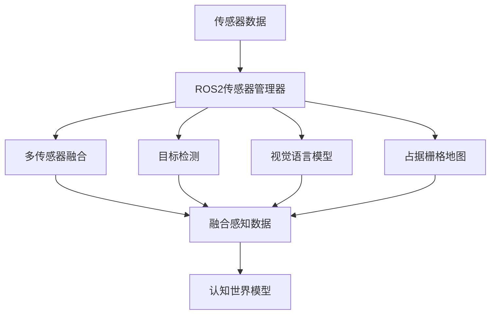

# 感知模块概述

Brain感知模块负责处理来自各种传感器的数据，提供环境感知和理解能力。该模块支持多种传感器类型，提供数据融合、目标检测和场景理解功能。

## 模块架构

## 核心组件

### 1. 传感器接口层

传感器接口层提供统一的传感器数据访问接口，支持：

- **图像传感器**: RGB相机、深度相机、热成像相机
- **距离传感器**: 激光雷达(LiDAR)、雷达
- **位置传感器**: IMU、GPS
- **其他传感器**: 天气传感器等

主要文件：
- `brain/perception/sensor_interface.py` - 传感器基类和实现
- `brain/perception/sensor_input_types.py` - 数据类型定义

### 2. 传感器管理层

传感器管理层负责管理多个传感器的数据流，包括：

- 多传感器数据同步
- 数据质量评估
- 传感器状态监控
- 数据缓冲和历史记录

主要文件：
- `brain/perception/sensors/sensor_manager.py` - 多传感器管理器
- `brain/perception/sensors/ros2_sensor_manager.py` - ROS2传感器管理器

### 3. 数据融合层

数据融合层将多传感器数据融合为一致的感知结果：

- 位姿估计与融合
- RGBD数据融合
- 障碍物检测与融合
- 多源位姿估计

主要文件：
- `brain/perception/sensors/sensor_fusion.py` - 传感器融合算法

### 4. 高级感知层

高级感知层提供更复杂的感知能力：

- 目标检测与跟踪
- 视觉语言模型场景理解
- 占据栅格地图生成
- 空间关系理解

主要文件：
- `brain/perception/object_detector.py` - 目标检测
- `brain/perception/vlm/vlm_perception.py` - VLM感知
- `brain/perception/mapping/occupancy_mapper.py` - 占据栅格地图

## 数据流程

1. **数据采集**: 从各种传感器获取原始数据
2. **预处理**: 数据格式转换、质量检查、降噪
3. **同步**: 多传感器数据时间对齐
4. **融合**: 多源数据融合，生成一致的环境表示
5. **高级处理**: 目标检测、场景理解、地图生成
6. **输出**: 提供结构化的感知数据给认知世界模型

## 性能特性

- **实时性**: 支持高频率传感器数据处理
- **容错性**: 处理传感器故障和数据丢失
- **可扩展性**: 易于添加新的传感器类型和处理算法
- **模块化**: 各组件可独立使用和测试

## 使用场景

- **自主导航**: 提供环境感知和障碍物检测
- **人机交互**: 理解人类指令并定位相关物体
- **场景分析**: 分析环境特征和空间关系
- **监控与检测**: 监测环境变化和特定目标

## 下一步

要了解各组件的详细信息，请参考：
- [传感器接口](sensor_interfaces.md)
- [多传感器融合](sensor_fusion.md)
- [ROS2集成](ros2_integration.md)

