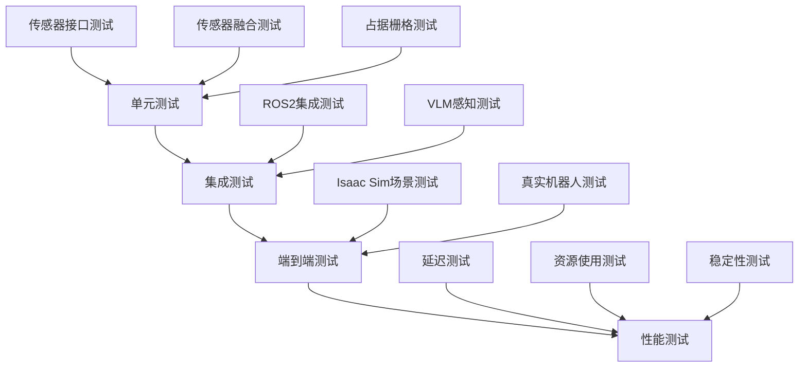

# 感知模块测试指南

本文档提供Brain感知模块的详细测试指南，包括单元测试、集成测试和端到端测试方法。

## 测试架构



## 测试环境设置

### 安装测试依赖

```bash
# 安装测试依赖
pip install pytest pytest-asyncio pytest-cov
pip install numpy-stubs  # 类型检查
pip install mock  # 模拟对象

# 安装文档依赖(可选)
pip install sphinx sphinx-rtd-theme
```

### 测试目录结构

```
tests/
├── unit/                  # 单元测试
│   ├── test_sensor_interface.py
│   ├── test_sensor_fusion.py
│   └── test_occupancy_mapper.py
├── integration/           # 集成测试
│   ├── test_ros2_integration.py
│   └── test_vlm_perception.py
├── end_to_end/           # 端到端测试
│   ├── test_isaac_sim.py
│   └── test_full_pipeline.py
├── performance/           # 性能测试
│   ├── test_latency.py
│   └── test_resource_usage.py
└── fixtures/              # 测试数据
    ├── sample_images/
    ├── sample_pointclouds/
    └── mock_data/
```

## 单元测试

### 传感器接口测试

```python
# tests/unit/test_sensor_interface.py
import pytest
import numpy as np
from unittest.mock import Mock, patch

from brain.perception.sensors.sensor_interface import (
    ImageSensor, PointCloudSensor, IMUSensor, GPSSensor, SensorConfig
)
from brain.perception.sensor_input_types import SensorType, ImageData, PointCloudData

class TestImageSensor:
    @pytest.fixture
    def config(self):
        return SensorConfig(
            sensor_id="test_camera",
            sensor_type=SensorType.CAMERA,
            update_rate=30.0,
            buffer_size=10
        )
    
    def test_initialization(self, config):
        sensor = ImageSensor(config)
        assert sensor.config.sensor_id == "test_camera"
        assert sensor.config.sensor_type == SensorType.CAMERA
        assert not sensor.is_running
    
    def test_start_stop(self, config):
        sensor = ImageSensor(config)
        assert sensor.start()
        assert sensor.is_running
        
        sensor.stop()
        assert not sensor.is_running
    
    def test_data_acquisition(self, config):
        sensor = ImageSensor(config)
        sensor.start()
        
        # 等待数据生成
        import time
        time.sleep(0.5)
        
        data_packets = sensor.get_latest_data(5)
        assert len(data_packets) > 0
        
        for packet in data_packets:
            assert isinstance(packet.data, ImageData)
            assert packet.sensor_id == "test_camera"
            assert 0 <= packet.quality_score <= 1.0
        
        sensor.stop()
    
    def test_statistics(self, config):
        sensor = ImageSensor(config)
        sensor.start()
        
        # 等待数据生成
        import time
        time.sleep(0.5)
        
        stats = sensor.get_statistics()
        assert "sensor_id" in stats
        assert "packets_received" in stats
        assert "packets_dropped" in stats
        assert "average_update_rate" in stats
        
        sensor.stop()

class TestPointCloudSensor:
    @pytest.fixture
    def config(self):
        return SensorConfig(
            sensor_id="test_lidar",
            sensor_type=SensorType.LIDAR,
            update_rate=10.0,
            buffer_size=10
        )
    
    def test_point_cloud_generation(self, config):
        sensor = PointCloudSensor(config)
        
        # 测试点云生成
        points = sensor._generate_synthetic_point_cloud(1000)
        assert points.shape == (1000, 3)
        assert not np.isnan(points).any()
    
    def test_noise_filtering(self, config):
        sensor = PointCloudSensor(config)
        
        # 创建测试点云
        points = np.random.randn(100, 3)
        intensity = np.random.rand(100)
        
        # 测试超出范围的点
        points[0] = [200, 200, 200]  # 超出max_range
        points[1] = [0.01, 0.01, 0.01]  # 低于min_range
        
        test_data = PointCloudData(points=points, intensity=intensity)
        filtered_data = sensor._apply_noise_filtering(test_data)
        
        # 验证超出范围的点被过滤
        assert filtered_data.points.shape[0] < 100
```

### 传感器融合测试

```python
# tests/unit/test_sensor_fusion.py
import pytest
import numpy as np

from brain.perception.sensors.sensor_fusion import EKFPoseFusion, DepthRGBFusion, ObstacleDetector

class TestEKFPoseFusion:
    @pytest.fixture
    def ekf(self):
        return EKFPoseFusion()
    
    def test_initialization(self, ekf):
        assert not ekf.initialized
        assert ekf.state.shape == (12,)
        assert ekf.P.shape == (12, 12)
    
    def test_odometry_update(self, ekf):
        odom_data = {
            "position": {"x": 1.0, "y": 2.0, "z": 0.0},
            "orientation": {"x": 0, "y": 0, "z": 0.1, "w": 0.995},
            "linear_velocity": {"x": 0.5, "y": 0.0, "z": 0.0},
            "angular_velocity": {"x": 0, "y": 0, "z": 0.1}
        }
        
        ekf.update_odom(odom_data)
        
        assert ekf.initialized
        assert ekf.state[0] == 1.0  # x
        assert ekf.state[1] == 2.0  # y
        assert ekf.state[2] == 0.0  # z
    
    def test_imu_update(self, ekf):
        # 首先更新里程计进行初始化
        odom_data = {
            "position": {"x": 0, "y": 0, "z": 0},
            "orientation": {"x": 0, "y": 0, "z": 0, "w": 1},
            "linear_velocity": {"x": 0, "y": 0, "z": 0},
            "angular_velocity": {"x": 0, "y": 0, "z": 0}
        }
        ekf.update_odom(odom_data)
        
        # 然后更新IMU
        imu_data = {
            "orientation": {"x": 0, "y": 0, "z": 0.05, "w": 0.9987},
            "angular_velocity": {"x": 0.01, "y": 0.02, "z": 0.1},
            "linear_acceleration": {"x": 0.1, "y": 0.05, "z": 9.81}
        }
        
        initial_roll = ekf.state[3]
        initial_pitch = ekf.state[4]
        
        ekf.update_imu(imu_data)
        
        # roll和pitch应该更新
        assert ekf.state[3] != initial_roll
        assert ekf.state[4] != initial_pitch
    
    def test_prediction(self, ekf):
        # 初始化
        odom_data = {
            "position": {"x": 0, "y": 0, "z": 0},
            "orientation": {"x": 0, "y": 0, "z": 0, "w": 1},
            "linear_velocity": {"x": 1.0, "y": 0.5, "z": 0},
            "angular_velocity": {"x": 0, "y": 0, "z": 0.1}
        }
        ekf.update_odom(odom_data)
        
        initial_x = ekf.state[0]
        initial_y = ekf.state[1]
        initial_yaw = ekf.state[5]
        
        # 预测1秒
        ekf.predict(dt=1.0)
        
        # 位置应该更新
        assert ekf.state[0] > initial_x  # x增加
        assert ekf.state[1] > initial_y  # y增加
        assert ekf.state[5] > initial_yaw  # yaw增加

class TestDepthRGBFusion:
    @pytest.fixture
    def fusion(self):
        return DepthRGBFusion()
    
    def test_fusion(self, fusion):
        # 创建测试数据
        h, w = 240, 320
        rgb = np.random.randint(0, 256, (h, w, 3), dtype=np.uint8)
        depth = np.random.rand(h, w) * 10.0
        
        # 融合
        rgbd, points = fusion.fuse(rgb, depth)
        
        assert rgbd.shape == (h, w, 4)
        assert points.shape[1] == 6  # X, Y, Z, R, G, B
        assert points.shape[0] > 0
```

### 占据栅格测试

```python
# tests/unit/test_occupancy_mapper.py
import pytest
import numpy as np

from brain.perception.mapping.occupancy_mapper import OccupancyMapper, OccupancyGrid

class TestOccupancyGrid:
    @pytest.fixture
    def grid(self):
        return OccupancyGrid(width=100, height=100, resolution=0.1)
    
    def test_initialization(self, grid):
        assert grid.width == 100
        assert grid.height == 100
        assert grid.resolution == 0.1
        assert grid.data.shape == (100, 100)
        assert np.all(grid.data == -1)  # 全部未知
    
    def test_coordinate_conversion(self, grid):
        # 世界坐标到栅格坐标
        grid_x, grid_y = grid.world_to_grid(5.0, 3.0)
        expected_x = int((5.0 - grid.origin_x) / grid.resolution)
        expected_y = int((3.0 - grid.origin_y) / grid.resolution)
        assert grid_x == expected_x
        assert grid_y == expected_y
        
        # 栅格坐标到世界坐标
        world_x, world_y = grid.grid_to_world(grid_x, grid_y)
        assert abs(world_x - 5.0) < 0.01
        assert abs(world_y - 3.0) < 0.01
    
    def test_cell_operations(self, grid):
        # 测试有效坐标
        assert grid.is_valid(50, 50)
        assert not grid.is_valid(-1, 0)
        assert not grid.is_valid(100, 0)
        
        # 设置和获取栅格
        grid.set_cell(50, 50, grid.CellState.OCCUPIED)
        assert grid.get_cell(50, 50) == grid.CellState.OCCUPIED
        assert grid.is_occupied(50, 50)
        assert not grid.is_free(50, 50)
        assert not grid.is_unknown(50, 50)

class TestOccupancyMapper:
    @pytest.fixture
    def mapper(self):
        return OccupancyMapper(resolution=0.1, map_size=10.0)
    
    def test_initialization(self, mapper):
        assert mapper.resolution == 0.1
        assert mapper.map_size == 10.0
        assert mapper.grid.width == 100
        assert mapper.grid.height == 100
    
    def test_depth_update(self, mapper):
        # 创建测试深度图
        h, w = 240, 320
        depth = np.ones((h, w)) * 5.0  # 5米远
        
        # 更新地图
        mapper.update_from_depth(depth, pose=(0, 0, 0))
        
        # 检查地图更新
        grid = mapper.get_grid()
        
        # 应该有一些占据和自由空间
        occupied_count = np.sum(grid.data == grid.CellState.OCCUPIED)
        free_count = np.sum(grid.data == grid.CellState.FREE)
        assert occupied_count > 0
        assert free_count > 0
    
    def test_laser_update(self, mapper):
        # 创建测试激光数据
        angles = np.linspace(-np.pi, np.pi, 360)
        ranges = np.ones(360) * 5.0
        
        # 更新地图
        mapper.update_from_laser(ranges.tolist(), angles.tolist(), pose=(0, 0, 0))
        
        # 检查地图更新
        grid = mapper.get_grid()
        
        # 应该有一些占据和自由空间
        occupied_count = np.sum(grid.data == grid.CellState.OCCUPIED)
        free_count = np.sum(grid.data == grid.CellState.FREE)
        assert occupied_count > 0
        assert free_count > 0
    
    def test_nearest_obstacle(self, mapper):
        # 手动设置一些障碍物
        mapper.grid.set_cell(50, 50, mapper.grid.CellState.OCCUPIED)
        mapper.grid.set_cell(60, 60, mapper.grid.CellState.OCCUPIED)
        
        # 查询最近障碍物
        nearest = mapper.get_nearest_obstacle(0, 0, max_range=5.0)
        
        assert nearest is not None
        obs_x, obs_y, distance = nearest
        assert 0 <= obs_x <= 10
        assert 0 <= obs_y <= 10
        assert distance > 0
```

## 集成测试

### ROS2集成测试

```python
# tests/integration/test_ros2_integration.py
import pytest
import asyncio
import numpy as np
from unittest.mock import AsyncMock, Mock

from brain.perception.sensors.ros2_sensor_manager import ROS2SensorManager, PerceptionData
from brain.perception.sensor_input_types import SensorType

class TestROS2SensorManager:
    @pytest.fixture
    async def ros2_interface(self):
        # 模拟ROS2接口
        interface = Mock()
        interface.get_sensor_data = AsyncMock()
        interface.get_rgb_image = Mock(return_value=np.random.randint(0, 256, (480, 640, 3)))
        interface.get_depth_image = Mock(return_value=np.random.rand(480, 640) * 10.0)
        interface.get_laser_scan = Mock(return_value={"ranges": [5.0]*360, "angles": [i*0.017 for i in range(360)]})
        return interface
    
    @pytest.fixture
    async def sensor_manager(self, ros2_interface):
        return ROS2SensorManager(ros2_interface)
    
    @pytest.mark.asyncio
    async def test_get_fused_perception(self, sensor_manager, ros2_interface):
        # 准备模拟数据
        ros2_interface.get_sensor_data.return_value = Mock(
            timestamp=1234567890.0,
            rgb_image=np.random.randint(0, 256, (480, 640, 3)),
            depth_image=np.random.rand(480, 640) * 10.0,
            laser_scan={"ranges": [5.0]*360, "angles": [i*0.017 for i in range(360)]},
            odometry={
                "position": {"x": 1.0, "y": 2.0, "z": 0.0},
                "orientation": {"x": 0, "y": 0, "z": 0, "w": 1},
                "linear_velocity": {"x": 0.5, "y": 0, "z": 0},
                "angular_velocity": {"x": 0, "y": 0, "z": 0.1}
            }
        )
        
        # 获取融合感知数据
        perception_data = await sensor_manager.get_fused_perception()
        
        # 验证数据
        assert isinstance(perception_data, PerceptionData)
        assert perception_data.rgb_image is not None
        assert perception_data.depth_image is not None
        assert perception_data.laser_ranges is not None
        assert perception_data.pose is not None
    
    @pytest.mark.asyncio
    async def test_sensor_health(self, sensor_manager):
        # 获取传感器健康状态
        health = sensor_manager.get_sensor_health()
        
        assert isinstance(health, dict)
        assert "rgb_camera" in health
        assert "depth_camera" in health
        assert "lidar" in health
        assert "imu" in health
    
    @pytest.mark.asyncio
    async def test_obstacle_detection(self, sensor_manager, ros2_interface):
        # 准备有障碍物的模拟数据
        ros2_interface.get_sensor_data.return_value = Mock(
            timestamp=1234567890.0,
            laser_scan={
                "ranges": [2.0, 2.0, 2.0, 2.0, 0.5, 0.5, 0.5, 2.0, 2.0] + [5.0]*351,
                "angles": [i*0.017 for i in range(360)]
            },
            odometry={
                "position": {"x": 0, "y": 0, "z": 0},
                "orientation": {"x": 0, "y": 0, "z": 0, "w": 1},
                "linear_velocity": {"x": 0, "y": 0, "z": 0},
                "angular_velocity": {"x": 0, "y": 0, "z": 0}
            }
        )
        
        # 获取融合感知数据
        perception_data = await sensor_manager.get_fused_perception()
        
        # 验证障碍物检测
        assert len(perception_data.obstacles) > 0
        
        # 检查最近障碍物
        nearest = sensor_manager.get_nearest_obstacle()
        assert nearest is not None
        assert nearest["distance"] < 1.0  # 应该检测到近距离障碍物
```

### VLM感知测试

```python
# tests/integration/test_vlm_perception.py
import pytest
import numpy as np
from unittest.mock import patch, AsyncMock

from brain.perception.vlm.vlm_perception import VLMPerception, SceneDescription, DetectedObject

class TestVLMPerception:
    @pytest.fixture
    def vlm(self):
        # 使用模拟模式
        with patch('brain.perception.vlm.vlm_perception.OLLAMA_AVAILABLE', False):
            return VLMPerception()
    
    @pytest.mark.asyncio
    async def test_describe_scene(self, vlm):
        # 创建测试图像
        image = np.random.randint(0, 256, (480, 640, 3))
        
        # 描述场景
        scene = await vlm.describe_scene(image)
        
        # 验证结果
        assert isinstance(scene, SceneDescription)
        assert scene.summary != ""
        assert len(scene.objects) > 0
        assert len(scene.spatial_relations) >= 0
        assert len(scene.navigation_hints) >= 0
    
    @pytest.mark.asyncio
    async def test_find_target(self, vlm):
        # 创建测试图像
        image = np.random.randint(0, 256, (480, 640, 3))
        
        # 搜索目标
        target = "门"
        result = await vlm.find_target(image, target)
        
        # 验证结果
        assert result.target_description == target
        assert result.found is not None
        if result.found:
            assert result.best_match is not None
            assert result.suggested_action != ""
            assert result.confidence > 0
    
    @pytest.mark.asyncio
    async def test_answer_spatial_query(self, vlm):
        # 创建测试图像
        image = np.random.randint(0, 256, (480, 640, 3))
        
        # 提问
        query = "门在哪个方向?"
        answer = await vlm.answer_spatial_query(image, query)
        
        # 验证结果
        assert isinstance(answer, str)
        assert len(answer) > 0
    
    def test_last_scene(self, vlm):
        # 获取最近的场景描述
        last_scene = vlm.get_last_scene()
        # 默认情况下应该为None
        assert last_scene is None
```

## 端到端测试

### Isaac Sim集成测试

```python
# tests/end_to_end/test_isaac_sim.py
import pytest
import asyncio
import numpy as np
from unittest.mock import patch, AsyncMock

class TestIsaacSimIntegration:
    @pytest.mark.asyncio
    async def test_full_pipeline(self):
        # 这需要Isaac Sim运行环境
        # 在CI/CD环境中可能需要跳过
        
        # 初始化ROS2
        from brain.communication.ros2_interface import ROS2Interface
        ros2 = ROS2Interface()
        
        # 初始化传感器管理器
        from brain.perception.sensors.ros2_sensor_manager import ROS2SensorManager
        sensor_manager = ROS2SensorManager(ros2)
        
        # 初始化目标检测器
        from brain.perception.object_detector import ObjectDetector
        detector = ObjectDetector()
        
        # 初始化VLM感知器
        from brain.perception.vlm.vlm_perception import VLMPerception
        vlm = VLMPerception()
        
        # 运行一段时间
        for i in range(10):
            # 获取融合感知数据
            perception_data = await sensor_manager.get_fused_perception()
            
            # 目标检测
            if perception_data.rgb_image is not None:
                detections = await detector.detect(perception_data.rgb_image)
                assert len(detections) >= 0
            
            # 场景理解
            if i % 5 == 0:  # 每5次循环执行一次VLM分析
                scene = await vlm.describe_scene(perception_data.rgb_image)
                assert isinstance(scene, type(SceneDescription))
            
            # 短暂延迟
            await asyncio.sleep(0.1)
```

## 性能测试

### 延迟测试

```python
# tests/performance/test_latency.py
import pytest
import asyncio
import time
import numpy as np
from unittest.mock import AsyncMock

from brain.perception.sensors.ros2_sensor_manager import ROS2SensorManager

class TestLatency:
    @pytest.mark.asyncio
    async def test_sensor_data_latency(self):
        # 创建模拟ROS2接口
        ros2 = AsyncMock()
        ros2.get_sensor_data = AsyncMock()
        
        # 创建传感器管理器
        sensor_manager = ROS2SensorManager(ros2)
        
        # 准备模拟数据
        ros2.get_sensor_data.return_value = Mock(
            timestamp=time.time(),
            rgb_image=np.random.randint(0, 256, (480, 640, 3)),
            depth_image=np.random.rand(480, 640) * 10.0,
            laser_scan={"ranges": [5.0]*360, "angles": [i*0.017 for i in range(360)]},
            odometry={"position": {"x": 1.0, "y": 2.0, "z": 0.0}, "orientation": {"x": 0, "y": 0, "z": 0, "w": 1}}
        )
        
        # 测量延迟
        latencies = []
        for _ in range(100):
            start_time = time.time()
            perception_data = await sensor_manager.get_fused_perception()
            end_time = time.time()
            latencies.append(end_time - start_time)
        
        # 计算统计
        avg_latency = sum(latencies) / len(latencies)
        max_latency = max(latencies)
        
        print(f"平均延迟: {avg_latency:.4f}秒")
        print(f"最大延迟: {max_latency:.4f}秒")
        
        # 验证延迟要求
        assert avg_latency < 0.1  # 平均延迟应小于100ms
        assert max_latency < 0.2  # 最大延迟应小于200ms
```

### 资源使用测试

```python
# tests/performance/test_resource_usage.py
import pytest
import asyncio
import psutil
import os
import numpy as np
from unittest.mock import AsyncMock

from brain.perception.sensors.ros2_sensor_manager import ROS2SensorManager

class TestResourceUsage:
    @pytest.mark.asyncio
    async def test_memory_usage(self):
        # 获取当前进程
        process = psutil.Process(os.getpid())
        
        # 创建模拟ROS2接口
        ros2 = AsyncMock()
        ros2.get_sensor_data = AsyncMock()
        
        # 创建传感器管理器
        sensor_manager = ROS2SensorManager(ros2)
        
        # 准备模拟数据
        ros2.get_sensor_data.return_value = Mock(
            timestamp=time.time(),
            rgb_image=np.random.randint(0, 256, (480, 640, 3)),
            depth_image=np.random.rand(480, 640) * 10.0,
            laser_scan={"ranges": [5.0]*360, "angles": [i*0.017 for i in range(360)]},
            odometry={"position": {"x": 1.0, "y": 2.0, "z": 0.0}, "orientation": {"x": 0, "y": 0, "z": 0, "w": 1}}
        )
        
        # 记录初始内存使用
        initial_memory = process.memory_info().rss / 1024 / 1024  # MB
        
        # 运行一段时间
        for i in range(1000):
            perception_data = await sensor_manager.get_fused_perception()
            await asyncio.sleep(0.01)  # 10Hz
        
        # 记录最终内存使用
        final_memory = process.memory_info().rss / 1024 / 1024  # MB
        
        memory_increase = final_memory - initial_memory
        
        print(f"初始内存: {initial_memory:.2f} MB")
        print(f"最终内存: {final_memory:.2f} MB")
        print(f"内存增长: {memory_increase:.2f} MB")
        
        # 验证内存使用
        assert memory_increase < 100  # 内存增长应小于100MB
```

## 测试执行

### 运行所有测试

```bash
# 运行所有测试
pytest

# 运行特定目录测试
pytest tests/unit/
pytest tests/integration/
pytest tests/end_to_end/
pytest tests/performance/

# 运行特定文件测试
pytest tests/unit/test_sensor_interface.py

# 运行特定测试类
pytest tests/unit/test_sensor_interface.py::TestImageSensor

# 运行特定测试方法
pytest tests/unit/test_sensor_interface.py::TestImageSensor::test_initialization
```

### 测试覆盖率

```bash
# 生成覆盖率报告
pytest --cov=brain.perception --cov-report=html

# 指定覆盖率阈值
pytest --cov=brain.perception --cov-fail-under=80

# 生成XML报告
pytest --cov=brain.perception --cov-report=xml
```

### 测试配置

```ini
# pytest.ini
[tool:pytest]
testpaths = tests
python_files = test_*.py
python_classes = Test*
python_functions = test_*
addopts = 
    --strict-markers
    --strict-config
    --verbose
    --tb=short
    --cov=brain.perception
    --cov-report=term-missing
    --cov-report=html
    --cov-fail-under=80
markers =
    unit: Unit tests
    integration: Integration tests
    end_to_end: End-to-end tests
    performance: Performance tests
    slow: Slow running tests
```

## 持续集成

### GitHub Actions配置

```yaml
# .github/workflows/test.yml
name: Tests

on:
  push:
    branches: [ main ]
  pull_request:
    branches: [ main ]

jobs:
  test:
    runs-on: ubuntu-latest
    strategy:
      matrix:
        python-version: [3.8, 3.9]

    steps:
    - uses: actions/checkout@v2
    - name: Set up Python ${{ matrix.python-version }}
      uses: actions/setup-python@v2
      with:
        python-version: ${{ matrix.python-version }}
    
    - name: Install dependencies
      run: |
        python -m pip install --upgrade pip
        pip install -r requirements.txt
        pip install pytest pytest-asyncio pytest-cov
    
    - name: Run unit tests
      run: |
        pytest tests/unit/ --cov=brain.perception --cov-report=xml
    
    - name: Upload coverage
      uses: codecov/codecov-action@v1
      with:
        file: ./coverage.xml
```

## 相关文档

- [传感器接口](sensor_interfaces.md)
- [多传感器融合](sensor_fusion.md)
- [ROS2集成](ros2_integration.md)
- [Isaac Sim集成](isaac_sim_integration.md)


